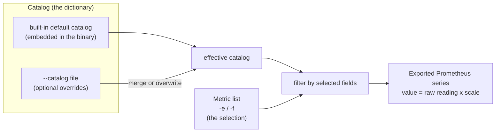

# rdc-exporter Configuration Guide

[繁體中文](README_zhtw.md) | [简体中文](README_zhcn.md)

## 1. Overview

rdc-exporter separates configuration into **two independent layers**, plus a few
command-line flags:

| Layer | What it controls | How you set it |
| --- | --- | --- |
| **Metric list** | *Which* metrics are exported (the selection) | `-e/--fields` on the command line, or `-f/--fields-file` |
| **Catalog** | *What each metric is* — its Prometheus name, HELP text, unit (`scale`), and RDC field id | `--catalog <file>`, merged onto the built-in default catalog |

The key idea: the **catalog is the dictionary** (every metric's identity and
unit), and the **metric list is the selection** (the subset you actually
publish). A complete default catalog is compiled into the binary, so most
deployments only need to manage the metric list — you reach for a custom catalog
only when you want to rename a metric, change its unit, or expose a field that
the default catalog does not describe.



Processing order at startup:

1. **Load the catalog.** Start from the embedded default catalog, then optionally
   merge your `--catalog` file onto it (or replace it entirely in `overwrite`
   mode).
2. **Apply the metric list.** Keep only the metrics selected by `-e` and `-f`. If
   both are empty, a built-in default selection is used.
3. **Publish.** Each selected metric is exported as a Prometheus gauge, where
   `published value = raw RDC reading × scale`.

## 2. Configuring the metric list

The metric list decides **which** metrics the exporter publishes. It does not
define names or units — that is the catalog's job (Section 3).

### 2.1 What a "field reference" is

Each entry in the metric list selects one metric from the catalog. You can
reference a metric by **any** of the following, and all three resolve to the same
metric:

| Reference form | Example |
| --- | --- |
| RDC field enum name | `RDC_FI_GPU_CLOCK` |
| Numeric RDC field id | `100` |
| Prometheus name (`prom_name`) | `gpu_clock` |

The complete list of fields, ids, and Prometheus names is in
[`docs/metrics.md`](../metrics.md).

> A reference that does not match any catalog entry is silently ignored. To
> export a field that the default catalog does not describe, first add it to a
> custom catalog (Section 3), then select it here.

### 2.2 On the command line (`-e` / `--fields`)

Pass a comma-separated list of field references:

```bash
rdc-exporter -e 100,812,gpu_temp
```

### 2.3 From a file (`-f` / `--fields-file`)

Point `-f` at a file with **one field reference per line**:

```text
# Telemetry
RDC_FI_GPU_CLOCK
RDC_FI_GPU_TEMP
gpu_memory_usage
# Profiling (by field id)
812
```

Parsing rules:

- One field reference per line; leading and trailing whitespace is trimmed.
- Blank lines are ignored.
- Any line that does not match a catalog entry is silently skipped — this is why
  lines beginning with `#` work as comments.
- `-e` and `-f` **combine**: entries from the file are added to those from `-e`.

### 2.4 Default selection

If you provide neither `-e` nor `-f`, the exporter publishes a built-in default
set of telemetry and common profiling fields:

```text
RDC_FI_GPU_CLOCK
RDC_FI_MEM_CLOCK
RDC_FI_MEMORY_TEMP
RDC_FI_GPU_TEMP
RDC_FI_POWER_USAGE
RDC_FI_GPU_UTIL
RDC_FI_GPU_MEMORY_USAGE
RDC_FI_GPU_MEMORY_TOTAL
RDC_FI_ECC_CORRECT_TOTAL
RDC_FI_ECC_UNCORRECT_TOTAL
RDC_FI_PROF_OCCUPANCY_PERCENT
RDC_FI_PROF_ACTIVE_CYCLES
RDC_FI_PROF_ACTIVE_WAVES
RDC_FI_PROF_ELAPSED_CYCLES
RDC_FI_PROF_TENSOR_ACTIVE_PERCENT
RDC_FI_PROF_GPU_UTIL_PERCENT
RDC_FI_PROF_EVAL_MEM_R_BW
RDC_FI_PROF_EVAL_MEM_W_BW
RDC_FI_PROF_EVAL_FLOPS_16
RDC_FI_PROF_EVAL_FLOPS_32
RDC_FI_PROF_EVAL_FLOPS_64
RDC_FI_PROF_VALU_PIPE_ISSUE_UTIL
RDC_FI_PROF_SM_ACTIVE
RDC_FI_PROF_OCC_PER_ACTIVE_CU
RDC_FI_PROF_OCC_ELAPSED
RDC_FI_PROF_EVAL_FLOPS_16_PERCENT
RDC_FI_PROF_EVAL_FLOPS_32_PERCENT
RDC_FI_PROF_EVAL_FLOPS_64_PERCENT
RDC_HEALTH_RETIRED_PAGE_NUM
```

> **Caution:** profiling fields (`RDC_FI_PROF_*`) map to GPU hardware performance
> counters and are bounded by a hardware packet limit. Selecting too many at once
> can stall collection. See
> [`docs/issues/0001-profiling-fields-pmc-packet-overflow.md`](../issues/0001-profiling-fields-pmc-packet-overflow.md).

### 2.5 In Kubernetes

In the DaemonSet, the metric list is mounted from a ConfigMap and passed via
`-f /etc/rdc-exporter/metrics.txt`. See the
[Kubernetes deployment guide](../deployment/k8s/README.md) for the full manifest.

## 3. Adjusting value units with the catalog

The catalog controls **what each metric is**: its Prometheus name, HELP text,
RDC field id, and — most importantly for unit conversion — its `scale`.

### 3.1 How `scale` works

Every reading is converted with a single multiplication before it is published:

```text
published value = raw RDC reading × scale
```

A `scale` of `1` (or any value `≤ 0`, which is normalized to `1`) leaves the raw
value untouched. A fractional `scale` re-bases a metric into a friendlier unit —
for example bytes to megabytes.

### 3.2 Default unit conversions

The default catalog already re-bases the common metrics into human-friendly
units:

| Metric (`prom_name`) | Field id | Raw unit | `scale` | Published unit |
| --- | --- | --- | --- | --- |
| `gpu_clock` | 100 | Hz | `0.000001` | MHz |
| `gpu_temp` | 201 | milli-°C | `0.001` | °C |
| `power_usage` | 300 | µW | `0.000001` | W |
| `gpu_memory_usage` | 501 | bytes | `0.000001` | MB |
| `gpu_memory_total` | 502 | bytes | `0.000001` | MB |

### 3.3 Example: change the memory unit (bytes ⇆ megabytes)

`gpu_memory_usage` is published in **MB** by default (`scale: 0.000001` over a raw
byte reading). To change the unit, override only this metric's `scale` in a
custom catalog:

```yaml
# catalog.yaml — keep memory in raw bytes
metrics:
  - metric: RDC_FI_GPU_MEMORY_USAGE
    scale: 1
```

```yaml
# catalog.yaml — report memory in GB instead of MB
metrics:
  - metric: RDC_FI_GPU_MEMORY_USAGE
    scale: 0.000000001
```

Run it with:

```bash
rdc-exporter --catalog ./catalog.yaml
```

Because the file is **merged** onto the default catalog (Section 3.5), you only
list the fields you are changing. The field id, Prometheus name, HELP text, and
every other metric are inherited from the default catalog.

### 3.4 Overriding the name, description, or disabling a metric

The same merge mechanism lets you rename a metric, rewrite its HELP text, or
turn it off:

```yaml
metrics:
  # rename + re-describe, keep the default unit conversion
  - metric: RDC_FI_GPU_TEMP
    prom_name: gpu_temperature_celsius
    desc: GPU edge temperature in Celsius
  # remove a metric from the effective catalog
  - metric: RDC_FI_GPU_CLOCK
    disabled: true
```

### 3.5 Merge vs. overwrite

| Mode | How to enable | Behavior |
| --- | --- | --- |
| **Merge** (default) | just provide `--catalog` | Your entries are overlaid on the default catalog **field by field**. Fields you omit keep their default values; metrics you do not mention are untouched. An entry with `disabled: true` is removed from the effective catalog. |
| **Overwrite** | add `overwrite: true` at the top level | Your list **replaces** the default catalog entirely. Use this when you want full control over the exact metric set and identities. |

```yaml
# overwrite mode — this list is the entire catalog
overwrite: true
metrics:
  - metric: RDC_FI_GPU_TEMP
    prom_name: gpu_temp
    field: "201"
    scale: 0.001
    desc: GPU temperature in Celsius
```

> In overwrite mode every entry must be complete: `metric`, `prom_name`, and
> `field` are all required. As a safety net, if an overwrite catalog ends up
> empty or invalid, the exporter falls back to the embedded default catalog so it
> never starts with no metrics.

### 3.6 Catalog entry reference

| Key | Required | Meaning |
| --- | --- | --- |
| `metric` | yes | RDC field enum name, e.g. `RDC_FI_GPU_TEMP`. The stable key used to merge user entries onto the default. |
| `field` | yes | Numeric RDC field id as a string, e.g. `"201"`. |
| `prom_name` | yes¹ | Exported Prometheus metric name, e.g. `gpu_temp`. |
| `scale` | no | Multiplier applied to the raw reading (default `1`). |
| `desc` | no | Prometheus HELP text. |
| `disabled` | no | When `true`, removes the metric from the effective catalog. |

¹ In a merged catalog `prom_name` is inherited from the default entry when
omitted. When omitted everywhere, it falls back to the field's lowercased enum
name. Every metric in the final catalog must end up with a `prom_name`, a
`field`, and a `metric` key, or startup fails validation. A non-positive `scale`
is normalized to `1`.

## 4. Differences from the NVIDIA DCGM exporter

If you are coming from the NVIDIA stack, the mental model is different. The DCGM
exporter uses a **single CSV** that mixes selection, naming, and help text in one
place. rdc-exporter **splits these concerns** into the catalog (definition/units)
and the metric list (selection).

| Aspect | NVIDIA DCGM exporter | rdc-exporter |
| --- | --- | --- |
| Config artifact | one CSV (e.g. `default-counters.csv`) | catalog YAML (optional) **+** metric list |
| What the file does | selects fields **and** sets metric type and help, together | catalog = identity + unit; metric list = selection, kept separate |
| Metric name | the DCGM field name (the CSV's first column) | configurable `prom_name`, with sensible defaults |
| Unit conversion | not part of the CSV; done later in recording rules / Grafana | first-class per-metric `scale` |
| Works with no config | needs a counters CSV | yes — an embedded default catalog + default selection |
| Turn a metric on/off | edit the CSV | edit the metric list (a tiny text file / ConfigMap) |
| Add a field not in defaults | add a CSV row | add a catalog entry, then select it |

A DCGM CSV row looks like this — field, type, and help in one line, with the
metric name derived from the field:

```csv
DCGM_FI_DEV_GPU_TEMP, gauge, GPU temperature (in C).
```

The equivalent in rdc-exporter is split in two. The **catalog** defines the
metric and its unit (and the default catalog already covers it):

```yaml
metrics:
  - metric: RDC_FI_GPU_TEMP
    prom_name: gpu_temp
    field: "201"
    scale: 0.001          # milli-°C -> °C, handled here, not downstream
    desc: GPU temperature in Celsius
```

…and the **metric list** simply selects it:

```text
RDC_FI_GPU_TEMP
```

**Why the split?** Selection changes often and is an operational concern (which
metrics do I want on this cluster right now?), while names and units are stable
definitions. Keeping them apart means you can flip metrics on and off with a tiny
list — or a Kubernetes ConfigMap — without ever restating names or units, and you
re-base a unit exactly once, in the catalog, instead of patching every dashboard
and recording rule.

## 5. Configuration-related CLI flags

| Flag | Short | Default | Purpose |
| --- | --- | --- | --- |
| `--fields` | `-e` | — | Comma-separated field references to export. |
| `--fields-file` | `-f` | — | File with one field reference per line. |
| `--catalog` | — | — | Path to a catalog YAML file (merged onto the default). |
| `--gpu-indexes` | `-i` | all GPUs | Comma-separated GPU indexes to scrape, e.g. `0,1,2`. |
| `--listen-address` | `-l` | `:5000` | Address the `/metrics` endpoint listens on. |
| `--kubelet` | `-k` | — | kubelet pod-resources socket path for Pod/namespace/container labels. |
| `--debug` | `-d` | `false` | Enable debug logging. |
| `--self-monitoring` | — | `false` | Export Go/process self-metrics. |

## 6. Worked example: a custom set in MB and bytes

Goal: export only temperature, power, and memory; keep temperature in °C, power
in W, but report memory usage in **raw bytes** instead of MB.

`catalog.yaml` (merge mode — only the memory override is needed):

```yaml
metrics:
  - metric: RDC_FI_GPU_MEMORY_USAGE
    scale: 1
```

`metrics.txt`:

```text
RDC_FI_GPU_TEMP
RDC_FI_POWER_USAGE
RDC_FI_GPU_MEMORY_USAGE
```

Run:

```bash
rdc-exporter --catalog ./catalog.yaml -f ./metrics.txt
```

Result: `gpu_temp` (°C) and `power_usage` (W) keep their default scales, while
`gpu_memory_usage` is now published in bytes.

## 7. References

- Full metric table: [`docs/metrics.md`](../metrics.md)
- Kubernetes deployment: [deployment guide](../deployment/k8s/README.md)
- Profiling hardware limit: [`docs/issues/0001-profiling-fields-pmc-packet-overflow.md`](../issues/0001-profiling-fields-pmc-packet-overflow.md)
