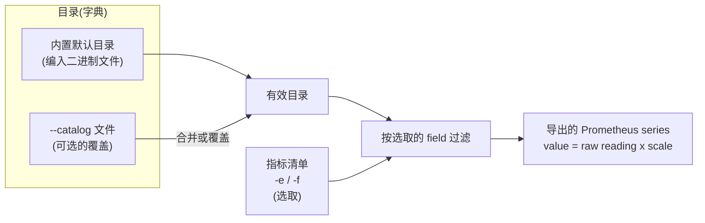

# rdc-exporter 配置指南

[English](README.md) | [繁體中文](README_zhtw.md)

## 1. 概览

rdc-exporter 的配置分为**两个独立的层次**,另加上少数命令行参数:

| 层次 | 控制的内容 | 配置方式 |
| --- | --- | --- |
| **指标清单(metric list)** | *要导出哪些*指标(选取) | 命令行 `-e/--fields`,或 `-f/--fields-file` |
| **目录(catalog)** | *每个指标是什么* — 它的 Prometheus 名称、HELP 说明、单位(`scale`)与 RDC field id | `--catalog <文件>`,会合并到内置的默认目录之上 |

核心观念:**目录是字典**(定义每个指标的身份与单位),**指标清单是选取**(你实际要导出的子集)。一份完整的默认目录已编译进二进制文件,因此多数部署只需要管理指标清单 — 只有当你想为指标改名、调整单位,或导出默认目录未描述的 field 时,才需要自定义目录。



启动时的处理顺序:

1. **加载目录。** 以内置默认目录为基础,接着可选地将你的 `--catalog` 文件合并到其上(或在 `overwrite` 模式下完全取代)。
2. **应用指标清单。** 只保留由 `-e` 与 `-f` 选取的指标。若两者皆为空,则使用内置的默认选取。
3. **导出。** 每个被选取的指标以 Prometheus gauge 导出,其中 `导出值 = RDC 原始读数 × scale`。

## 2. 配置指标清单

指标清单决定 exporter **要导出哪些**指标。它不定义名称或单位 — 那是目录的工作(第 3 节)。

### 2.1 什么是“field 引用”

指标清单中的每一项,都会从目录选取一个指标。你可以用下列**任一种**形式引用,三者都会解析到同一个指标:

| 引用形式 | 示例 |
| --- | --- |
| RDC field 枚举名称 | `RDC_FI_GPU_CLOCK` |
| RDC 数字 field id | `100` |
| Prometheus 名称(`prom_name`) | `gpu_clock` |

完整的 field、id 与 Prometheus 名称清单请见 [`docs/metrics.md`](../metrics.md)。

> 无法对应到任何目录条目的引用会被静默忽略。若要导出默认目录未描述的 field,请先把它加入自定义目录(第 3 节),再于此处选取。

### 2.2 通过命令行(`-e` / `--fields`)

传入以逗号分隔的 field 引用清单:

```bash
rdc-exporter -e 100,812,gpu_temp
```

### 2.3 通过文件(`-f` / `--fields-file`)

让 `-f` 指向一个**每行一个 field 引用**的文件:

```text
# Telemetry
RDC_FI_GPU_CLOCK
RDC_FI_GPU_TEMP
gpu_memory_usage
# Profiling(以 field id 表示)
812
```

解析规则:

- 每行一个 field 引用;会去除前后空白。
- 空行会被忽略。
- 任何无法对应到目录条目的行会被静默跳过 — 这正是以 `#` 开头的行可作为注释的原因。
- `-e` 与 `-f` 会**合并**:文件中的条目会加到 `-e` 的条目之后。

### 2.4 默认选取

若你既未提供 `-e` 也未提供 `-f`,exporter 会导出一组内置的默认集合,包含遥测(telemetry)与常用的 profiling field:

```text
RDC_FI_GPU_CLOCK
RDC_FI_MEM_CLOCK
RDC_FI_MEMORY_TEMP
RDC_FI_GPU_TEMP
RDC_FI_POWER_USAGE
RDC_FI_GPU_UTIL
RDC_FI_GPU_MEMORY_USAGE
RDC_FI_GPU_MEMORY_TOTAL
RDC_FI_ECC_CORRECT_TOTAL
RDC_FI_ECC_UNCORRECT_TOTAL
RDC_FI_PROF_OCCUPANCY_PERCENT
RDC_FI_PROF_ACTIVE_CYCLES
RDC_FI_PROF_ACTIVE_WAVES
RDC_FI_PROF_ELAPSED_CYCLES
RDC_FI_PROF_TENSOR_ACTIVE_PERCENT
RDC_FI_PROF_GPU_UTIL_PERCENT
RDC_FI_PROF_EVAL_MEM_R_BW
RDC_FI_PROF_EVAL_MEM_W_BW
RDC_FI_PROF_EVAL_FLOPS_16
RDC_FI_PROF_EVAL_FLOPS_32
RDC_FI_PROF_EVAL_FLOPS_64
RDC_FI_PROF_VALU_PIPE_ISSUE_UTIL
RDC_FI_PROF_SM_ACTIVE
RDC_FI_PROF_OCC_PER_ACTIVE_CU
RDC_FI_PROF_OCC_ELAPSED
RDC_FI_PROF_EVAL_FLOPS_16_PERCENT
RDC_FI_PROF_EVAL_FLOPS_32_PERCENT
RDC_FI_PROF_EVAL_FLOPS_64_PERCENT
RDC_HEALTH_RETIRED_PAGE_NUM
```

> **注意:** profiling field(`RDC_FI_PROF_*`)对应 GPU 硬件性能计数器,受硬件数据包上限限制。一次选取过多可能导致采集停滞。详见 [`docs/issues/0001-profiling-fields-pmc-packet-overflow.md`](../issues/0001-profiling-fields-pmc-packet-overflow.md)。

### 2.5 在 Kubernetes 中

在 DaemonSet 里,指标清单通过 ConfigMap 挂载,并以 `-f /etc/rdc-exporter/metrics.txt` 传入。完整清单请见 [Kubernetes 部署指南](../deployment/k8s/README_zhcn.md)。

## 3. 用目录调整数值单位

目录控制**每个指标是什么**:它的 Prometheus 名称、HELP 说明、RDC field id,以及对单位转换最重要的 `scale`。

### 3.1 `scale` 的工作方式

每笔读数在导出前都会经过单一乘法转换:

```text
导出值 = RDC 原始读数 × scale
```

`scale` 为 `1`(或任何 `≤ 0` 的值,皆会归一化为 `1`)时,原始值保持不变。小数的 `scale` 会把指标重新换算成更易读的单位 — 例如把 bytes 换成 megabytes。

### 3.2 默认的单位转换

默认目录已将常见指标换算成易于阅读的单位:

| 指标(`prom_name`) | Field id | 原始单位 | `scale` | 导出单位 |
| --- | --- | --- | --- | --- |
| `gpu_clock` | 100 | Hz | `0.000001` | MHz |
| `gpu_temp` | 201 | 毫°C | `0.001` | °C |
| `power_usage` | 300 | µW | `0.000001` | W |
| `gpu_memory_usage` | 501 | bytes | `0.000001` | MB |
| `gpu_memory_total` | 502 | bytes | `0.000001` | MB |

### 3.3 示例:更换内存单位(bytes ⇆ megabytes)

`gpu_memory_usage` 默认以 **MB** 导出(对原始 byte 读数应用 `scale: 0.000001`)。若要更换单位,只需在自定义目录中覆盖此指标的 `scale`:

```yaml
# catalog.yaml — 内存保持原始 bytes
metrics:
  - metric: RDC_FI_GPU_MEMORY_USAGE
    scale: 1
```

```yaml
# catalog.yaml — 以 GB 取代 MB 导出内存
metrics:
  - metric: RDC_FI_GPU_MEMORY_USAGE
    scale: 0.000000001
```

以下列方式运行:

```bash
rdc-exporter --catalog ./catalog.yaml
```

由于该文件是**合并**到默认目录之上(第 3.5 节),你只需列出要变更的字段。field id、Prometheus 名称、HELP 说明,以及其他所有指标,都会从默认目录继承。

### 3.4 覆盖名称、说明,或停用某个指标

同样的合并机制让你能为指标改名、改写 HELP 说明,或将它关闭:

```yaml
metrics:
  # 改名 + 重写说明,保持默认的单位转换
  - metric: RDC_FI_GPU_TEMP
    prom_name: gpu_temperature_celsius
    desc: GPU edge temperature in Celsius
  # 将某指标从有效目录移除
  - metric: RDC_FI_GPU_CLOCK
    disabled: true
```

### 3.5 合并(merge)与覆盖(overwrite)

| 模式 | 启用方式 | 行为 |
| --- | --- | --- |
| **合并**(默认) | 只要提供 `--catalog` | 你的条目会**逐字段**叠加到默认目录上。你省略的字段保持其默认值;你未提及的指标保持不变。标注 `disabled: true` 的条目会从有效目录移除。 |
| **覆盖** | 在最顶层加入 `overwrite: true` | 你的清单会**完全取代**默认目录。当你想完整掌控确切的指标集合与身份时使用。 |

```yaml
# 覆盖模式 — 此清单即为整份目录
overwrite: true
metrics:
  - metric: RDC_FI_GPU_TEMP
    prom_name: gpu_temp
    field: "201"
    scale: 0.001
    desc: GPU temperature in Celsius
```

> 在覆盖模式下,每笔条目都必须完整:`metric`、`prom_name` 与 `field` 皆为必填。作为保护机制,若覆盖目录最终为空或无效,exporter 会退回内置的默认目录,确保它绝不会在没有任何指标的情况下启动。

### 3.6 目录条目参考

| 键 | 必填 | 含义 |
| --- | --- | --- |
| `metric` | 是 | RDC field 枚举名称,例如 `RDC_FI_GPU_TEMP`。用于将用户条目合并到默认目录的稳定键。 |
| `field` | 是 | 以字符串表示的 RDC 数字 field id,例如 `"201"`。 |
| `prom_name` | 是¹ | 导出的 Prometheus 指标名称,例如 `gpu_temp`。 |
| `scale` | 否 | 应用于原始读数的乘数(默认 `1`)。 |
| `desc` | 否 | Prometheus HELP 说明。 |
| `disabled` | 否 | 为 `true` 时,将该指标从有效目录移除。 |

¹ 在合并目录中,省略 `prom_name` 时会从默认条目继承。若各处皆省略,则退回使用该 field 的小写枚举名称。最终目录中的每个指标都必须具备 `prom_name`、`field` 与 `metric` 键,否则启动时验证失败。非正值的 `scale` 会被归一化为 `1`。

## 4. 与 NVIDIA DCGM exporter 的差异

若你来自 NVIDIA 生态,心智模型有所不同。DCGM exporter 使用**单一 CSV**,把选取、命名与说明文字全混在一处。rdc-exporter 则把这些关注点**拆开**:目录(定义/单位)与指标清单(选取)。

| 方面 | NVIDIA DCGM exporter | rdc-exporter |
| --- | --- | --- |
| 配置文件 | 单一 CSV(例如 `default-counters.csv`) | 目录 YAML(可选)**＋**指标清单 |
| 文件的作用 | 同时负责选取 field **以及**设定指标类型与说明 | 目录 = 身份 + 单位;指标清单 = 选取,两者分开 |
| 指标名称 | 即 DCGM field 名称(CSV 第一列) | 可配置的 `prom_name`,并提供合理默认 |
| 单位转换 | 不在 CSV 内;之后于 recording rules / Grafana 处理 | 一等公民,每个指标可设 `scale` |
| 无配置即可运行 | 需要 counters CSV | 可以 — 内置默认目录 + 默认选取 |
| 开关某指标 | 编辑 CSV | 编辑指标清单(一个极小的文本文件 / ConfigMap) |
| 加入默认没有的 field | 新增一行 CSV | 新增一笔目录条目,再加以选取 |

一行 DCGM CSV 看起来像这样 — field、类型与说明在同一行,指标名称由 field 衍生:

```csv
DCGM_FI_DEV_GPU_TEMP, gauge, GPU temperature (in C).
```

在 rdc-exporter 中,对应的配置拆成两部分。**目录**定义指标及其单位(默认目录其实已涵盖它):

```yaml
metrics:
  - metric: RDC_FI_GPU_TEMP
    prom_name: gpu_temp
    field: "201"
    scale: 0.001          # 毫°C -> °C,在此处理,而非下游
    desc: GPU temperature in Celsius
```

……而**指标清单**只负责选取它:

```text
RDC_FI_GPU_TEMP
```

**为什么要拆开?** 选取经常变动,且属于运维关注(我这座集群现在想要哪些指标?),而名称与单位则是稳定的定义。把它们分开,代表你可以用一份极小的清单 — 或一个 Kubernetes ConfigMap — 开关指标,而完全不必重述名称或单位;而且你只需在目录里换算单位一次,不必逐一修补每个仪表盘与 recording rule。

## 5. 与配置相关的 CLI 参数

| 参数 | 简写 | 默认 | 用途 |
| --- | --- | --- | --- |
| `--fields` | `-e` | — | 以逗号分隔、要导出的 field 引用。 |
| `--fields-file` | `-f` | — | 每行一个 field 引用的文件。 |
| `--catalog` | — | — | 目录 YAML 文件路径(合并到默认目录之上)。 |
| `--gpu-indexes` | `-i` | 全部 GPU | 以逗号分隔、要采集的 GPU 索引,例如 `0,1,2`。 |
| `--listen-address` | `-l` | `:5000` | `/metrics` 端点监听的地址。 |
| `--kubelet` | `-k` | — | kubelet pod-resources socket 路径,用于 Pod/namespace/container 标签。 |
| `--debug` | `-d` | `false` | 启用调试日志。 |
| `--self-monitoring` | — | `false` | 导出 Go/process 自我监控指标。 |

## 6. 完整示例:以 MB 与 bytes 组成自定义集合

目标:只导出温度、功耗与内存;温度保持 °C、功耗保持 W,但内存用量改以**原始 bytes** 而非 MB 导出。

`catalog.yaml`(合并模式 — 只需内存这项覆盖):

```yaml
metrics:
  - metric: RDC_FI_GPU_MEMORY_USAGE
    scale: 1
```

`metrics.txt`:

```text
RDC_FI_GPU_TEMP
RDC_FI_POWER_USAGE
RDC_FI_GPU_MEMORY_USAGE
```

运行:

```bash
rdc-exporter --catalog ./catalog.yaml -f ./metrics.txt
```

结果:`gpu_temp`(°C)与 `power_usage`(W)保持其默认 scale,而 `gpu_memory_usage` 现在以 bytes 导出。

## 7. 参考资料

- 完整指标表:[`docs/metrics.md`](../metrics.md)
- Kubernetes 部署:[部署指南](../deployment/k8s/README_zhcn.md)
- Profiling 硬件上限:[`docs/issues/0001-profiling-fields-pmc-packet-overflow.md`](../issues/0001-profiling-fields-pmc-packet-overflow.md)
