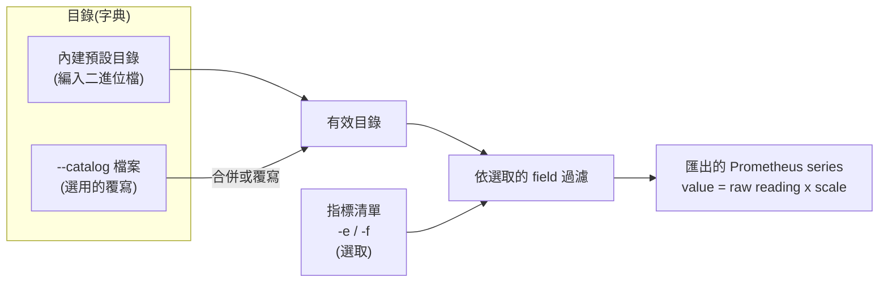

# rdc-exporter 設定指南

[English](README.md) | [简体中文](README_zhcn.md)

## 1. 概觀

rdc-exporter 的設定分為**兩個獨立的層次**,另加上少數命令列參數:

| 層次 | 控制的內容 | 設定方式 |
| --- | --- | --- |
| **指標清單(metric list)** | *要匯出哪些*指標(選取) | 命令列 `-e/--fields`,或 `-f/--fields-file` |
| **目錄(catalog)** | *每個指標是什麼* — 它的 Prometheus 名稱、HELP 說明、單位(`scale`)與 RDC field id | `--catalog <檔案>`,會合併到內建的預設目錄之上 |

核心觀念:**目錄是字典**(定義每個指標的身分與單位),**指標清單是選取**(你實際要匯出的子集)。一份完整的預設目錄已編譯進二進位檔,因此多數部署只需要管理指標清單 — 只有當你想為指標改名、調整單位,或匯出預設目錄未描述的 field 時,才需要自訂目錄。



啟動時的處理順序:

1. **載入目錄。** 以內建預設目錄為基礎,接著選擇性地將你的 `--catalog` 檔案合併到其上(或在 `overwrite` 模式下完全取代)。
2. **套用指標清單。** 只保留由 `-e` 與 `-f` 選取的指標。若兩者皆為空,則使用內建的預設選取。
3. **匯出。** 每個被選取的指標以 Prometheus gauge 匯出,其中 `匯出值 = RDC 原始讀數 × scale`。

## 2. 設定指標清單

指標清單決定 exporter **要匯出哪些**指標。它不定義名稱或單位 — 那是目錄的工作(第 3 節)。

### 2.1 什麼是「field 參照」

指標清單中的每一筆,都會從目錄選取一個指標。你可以用下列**任一種**形式參照,三者都會解析到同一個指標:

| 參照形式 | 範例 |
| --- | --- |
| RDC field 列舉名稱 | `RDC_FI_GPU_CLOCK` |
| RDC 數字 field id | `100` |
| Prometheus 名稱(`prom_name`) | `gpu_clock` |

完整的 field、id 與 Prometheus 名稱清單請見 [`docs/metrics.md`](../metrics.md)。

> 無法對應到任何目錄項目的參照會被靜默忽略。若要匯出預設目錄未描述的 field,請先把它加入自訂目錄(第 3 節),再於此處選取。

### 2.2 透過命令列(`-e` / `--fields`)

傳入以逗號分隔的 field 參照清單:

```bash
rdc-exporter -e 100,812,gpu_temp
```

### 2.3 透過檔案(`-f` / `--fields-file`)

讓 `-f` 指向一個**每行一個 field 參照**的檔案:

```text
# Telemetry
RDC_FI_GPU_CLOCK
RDC_FI_GPU_TEMP
gpu_memory_usage
# Profiling(以 field id 表示)
812
```

解析規則:

- 每行一個 field 參照;會去除前後空白。
- 空行會被忽略。
- 任何無法對應到目錄項目的行會被靜默略過 — 這正是以 `#` 開頭的行可作為註解的原因。
- `-e` 與 `-f` 會**合併**:檔案中的項目會加到 `-e` 的項目之後。

### 2.4 預設選取

若你既未提供 `-e` 也未提供 `-f`,exporter 會匯出一組內建的預設集合,包含遙測(telemetry)與常用的 profiling field:

```text
RDC_FI_GPU_CLOCK
RDC_FI_MEM_CLOCK
RDC_FI_MEMORY_TEMP
RDC_FI_GPU_TEMP
RDC_FI_POWER_USAGE
RDC_FI_GPU_UTIL
RDC_FI_GPU_MEMORY_USAGE
RDC_FI_GPU_MEMORY_TOTAL
RDC_FI_ECC_CORRECT_TOTAL
RDC_FI_ECC_UNCORRECT_TOTAL
RDC_FI_PROF_OCCUPANCY_PERCENT
RDC_FI_PROF_ACTIVE_CYCLES
RDC_FI_PROF_ACTIVE_WAVES
RDC_FI_PROF_ELAPSED_CYCLES
RDC_FI_PROF_TENSOR_ACTIVE_PERCENT
RDC_FI_PROF_GPU_UTIL_PERCENT
RDC_FI_PROF_EVAL_MEM_R_BW
RDC_FI_PROF_EVAL_MEM_W_BW
RDC_FI_PROF_EVAL_FLOPS_16
RDC_FI_PROF_EVAL_FLOPS_32
RDC_FI_PROF_EVAL_FLOPS_64
RDC_FI_PROF_VALU_PIPE_ISSUE_UTIL
RDC_FI_PROF_SM_ACTIVE
RDC_FI_PROF_OCC_PER_ACTIVE_CU
RDC_FI_PROF_OCC_ELAPSED
RDC_FI_PROF_EVAL_FLOPS_16_PERCENT
RDC_FI_PROF_EVAL_FLOPS_32_PERCENT
RDC_FI_PROF_EVAL_FLOPS_64_PERCENT
RDC_HEALTH_RETIRED_PAGE_NUM
```

> **注意:** profiling field(`RDC_FI_PROF_*`)對應 GPU 硬體效能計數器,受硬體封包上限限制。一次選取過多可能導致採集停滯。詳見 [`docs/issues/0001-profiling-fields-pmc-packet-overflow.md`](../issues/0001-profiling-fields-pmc-packet-overflow.md)。

### 2.5 在 Kubernetes 中

在 DaemonSet 裡,指標清單透過 ConfigMap 掛載,並以 `-f /etc/rdc-exporter/metrics.txt` 傳入。完整資訊清單請見 [Kubernetes 部署指南](../deployment/k8s/README_zhtw.md)。

## 3. 以目錄調整數值單位

目錄控制**每個指標是什麼**:它的 Prometheus 名稱、HELP 說明、RDC field id,以及對單位轉換最重要的 `scale`。

### 3.1 `scale` 的運作方式

每筆讀數在匯出前都會經過單一乘法轉換:

```text
匯出值 = RDC 原始讀數 × scale
```

`scale` 為 `1`(或任何 `≤ 0` 的值,皆會正規化為 `1`)時,原始值維持不變。小數的 `scale` 會把指標重新換算成更易讀的單位 — 例如把 bytes 換成 megabytes。

### 3.2 預設的單位轉換

預設目錄已將常見指標換算成易於閱讀的單位:

| 指標(`prom_name`) | Field id | 原始單位 | `scale` | 匯出單位 |
| --- | --- | --- | --- | --- |
| `gpu_clock` | 100 | Hz | `0.000001` | MHz |
| `gpu_temp` | 201 | 毫°C | `0.001` | °C |
| `power_usage` | 300 | µW | `0.000001` | W |
| `gpu_memory_usage` | 501 | bytes | `0.000001` | MB |
| `gpu_memory_total` | 502 | bytes | `0.000001` | MB |

### 3.3 範例:更換記憶體單位(bytes ⇆ megabytes)

`gpu_memory_usage` 預設以 **MB** 匯出(對原始 byte 讀數套用 `scale: 0.000001`)。若要更換單位,只需在自訂目錄中覆寫此指標的 `scale`:

```yaml
# catalog.yaml — 記憶體維持原始 bytes
metrics:
  - metric: RDC_FI_GPU_MEMORY_USAGE
    scale: 1
```

```yaml
# catalog.yaml — 以 GB 取代 MB 匯出記憶體
metrics:
  - metric: RDC_FI_GPU_MEMORY_USAGE
    scale: 0.000000001
```

以下列方式執行:

```bash
rdc-exporter --catalog ./catalog.yaml
```

由於該檔案是**合併**到預設目錄之上(第 3.5 節),你只需列出要變更的欄位。field id、Prometheus 名稱、HELP 說明,以及其他所有指標,都會從預設目錄繼承。

### 3.4 覆寫名稱、說明,或停用某個指標

同樣的合併機制讓你能為指標改名、改寫 HELP 說明,或將它關閉:

```yaml
metrics:
  # 改名 + 重寫說明,維持預設的單位轉換
  - metric: RDC_FI_GPU_TEMP
    prom_name: gpu_temperature_celsius
    desc: GPU edge temperature in Celsius
  # 將某指標從有效目錄移除
  - metric: RDC_FI_GPU_CLOCK
    disabled: true
```

### 3.5 合併(merge)與覆寫(overwrite)

| 模式 | 啟用方式 | 行為 |
| --- | --- | --- |
| **合併**(預設) | 只要提供 `--catalog` | 你的項目會**逐欄位**疊加到預設目錄上。你省略的欄位維持其預設值;你未提及的指標保持不變。標示 `disabled: true` 的項目會從有效目錄移除。 |
| **覆寫** | 在最上層加入 `overwrite: true` | 你的清單會**完全取代**預設目錄。當你想完整掌控確切的指標集合與身分時使用。 |

```yaml
# 覆寫模式 — 此清單即為整份目錄
overwrite: true
metrics:
  - metric: RDC_FI_GPU_TEMP
    prom_name: gpu_temp
    field: "201"
    scale: 0.001
    desc: GPU temperature in Celsius
```

> 在覆寫模式下,每筆項目都必須完整:`metric`、`prom_name` 與 `field` 皆為必填。作為保護機制,若覆寫目錄最終為空或無效,exporter 會退回內建的預設目錄,確保它絕不會在沒有任何指標的情況下啟動。

### 3.6 目錄項目參照

| 鍵 | 必填 | 意義 |
| --- | --- | --- |
| `metric` | 是 | RDC field 列舉名稱,例如 `RDC_FI_GPU_TEMP`。用於將使用者項目合併到預設目錄的穩定鍵。 |
| `field` | 是 | 以字串表示的 RDC 數字 field id,例如 `"201"`。 |
| `prom_name` | 是¹ | 匯出的 Prometheus 指標名稱,例如 `gpu_temp`。 |
| `scale` | 否 | 套用於原始讀數的乘數(預設 `1`)。 |
| `desc` | 否 | Prometheus HELP 說明。 |
| `disabled` | 否 | 為 `true` 時,將該指標從有效目錄移除。 |

¹ 在合併目錄中,省略 `prom_name` 時會從預設項目繼承。若各處皆省略,則退回使用該 field 的小寫列舉名稱。最終目錄中的每個指標都必須具備 `prom_name`、`field` 與 `metric` 鍵,否則啟動時驗證失敗。非正值的 `scale` 會被正規化為 `1`。

## 4. 與 NVIDIA DCGM exporter 的差異

若你來自 NVIDIA 生態系,心智模型有所不同。DCGM exporter 使用**單一 CSV**,把選取、命名與說明文字全混在一處。rdc-exporter 則把這些關注點**拆開**:目錄(定義/單位)與指標清單(選取)。

| 面向 | NVIDIA DCGM exporter | rdc-exporter |
| --- | --- | --- |
| 設定檔 | 單一 CSV(例如 `default-counters.csv`) | 目錄 YAML(選用)**＋**指標清單 |
| 檔案的作用 | 同時負責選取 field **以及**設定指標型別與說明 | 目錄 = 身分 + 單位;指標清單 = 選取,兩者分開 |
| 指標名稱 | 即 DCGM field 名稱(CSV 第一欄) | 可設定的 `prom_name`,並提供合理預設 |
| 單位轉換 | 不在 CSV 內;之後於 recording rules / Grafana 處理 | 一級公民,每個指標可設 `scale` |
| 無設定即可運作 | 需要 counters CSV | 可以 — 內建預設目錄 + 預設選取 |
| 開關某指標 | 編輯 CSV | 編輯指標清單(一個極小的文字檔 / ConfigMap) |
| 加入預設沒有的 field | 新增一列 CSV | 新增一筆目錄項目,再加以選取 |

一列 DCGM CSV 看起來像這樣 — field、型別與說明在同一行,指標名稱由 field 衍生:

```csv
DCGM_FI_DEV_GPU_TEMP, gauge, GPU temperature (in C).
```

在 rdc-exporter 中,對應的設定拆成兩部分。**目錄**定義指標及其單位(預設目錄其實已涵蓋它):

```yaml
metrics:
  - metric: RDC_FI_GPU_TEMP
    prom_name: gpu_temp
    field: "201"
    scale: 0.001          # 毫°C -> °C,在此處理,而非下游
    desc: GPU temperature in Celsius
```

……而**指標清單**只負責選取它:

```text
RDC_FI_GPU_TEMP
```

**為什麼要拆開?** 選取經常變動,且屬於維運關注(我這座叢集現在想要哪些指標?),而名稱與單位則是穩定的定義。把它們分開,代表你可以用一份極小的清單 — 或一個 Kubernetes ConfigMap — 開關指標,而完全不必重述名稱或單位;而且你只需在目錄裡換算單位一次,不必逐一修補每個儀表板與 recording rule。

## 5. 與設定相關的 CLI 參數

| 參數 | 簡寫 | 預設 | 用途 |
| --- | --- | --- | --- |
| `--fields` | `-e` | — | 以逗號分隔、要匯出的 field 參照。 |
| `--fields-file` | `-f` | — | 每行一個 field 參照的檔案。 |
| `--catalog` | — | — | 目錄 YAML 檔案路徑(合併到預設目錄之上)。 |
| `--gpu-indexes` | `-i` | 全部 GPU | 以逗號分隔、要採集的 GPU 索引,例如 `0,1,2`。 |
| `--listen-address` | `-l` | `:5000` | `/metrics` 端點監聽的位址。 |
| `--kubelet` | `-k` | — | kubelet pod-resources socket 路徑,用於 Pod/namespace/container 標籤。 |
| `--debug` | `-d` | `false` | 啟用除錯日誌。 |
| `--self-monitoring` | — | `false` | 匯出 Go/process 自我監控指標。 |

## 6. 完整範例:以 MB 與 bytes 組成自訂集合

目標:只匯出溫度、功耗與記憶體;溫度維持 °C、功耗維持 W,但記憶體用量改以**原始 bytes** 而非 MB 匯出。

`catalog.yaml`(合併模式 — 只需記憶體這項覆寫):

```yaml
metrics:
  - metric: RDC_FI_GPU_MEMORY_USAGE
    scale: 1
```

`metrics.txt`:

```text
RDC_FI_GPU_TEMP
RDC_FI_POWER_USAGE
RDC_FI_GPU_MEMORY_USAGE
```

執行:

```bash
rdc-exporter --catalog ./catalog.yaml -f ./metrics.txt
```

結果:`gpu_temp`(°C)與 `power_usage`(W)維持其預設 scale,而 `gpu_memory_usage` 現在以 bytes 匯出。

## 7. 參考資料

- 完整指標表:[`docs/metrics.md`](../metrics.md)
- Kubernetes 部署:[部署指南](../deployment/k8s/README_zhtw.md)
- Profiling 硬體上限:[`docs/issues/0001-profiling-fields-pmc-packet-overflow.md`](../issues/0001-profiling-fields-pmc-packet-overflow.md)
