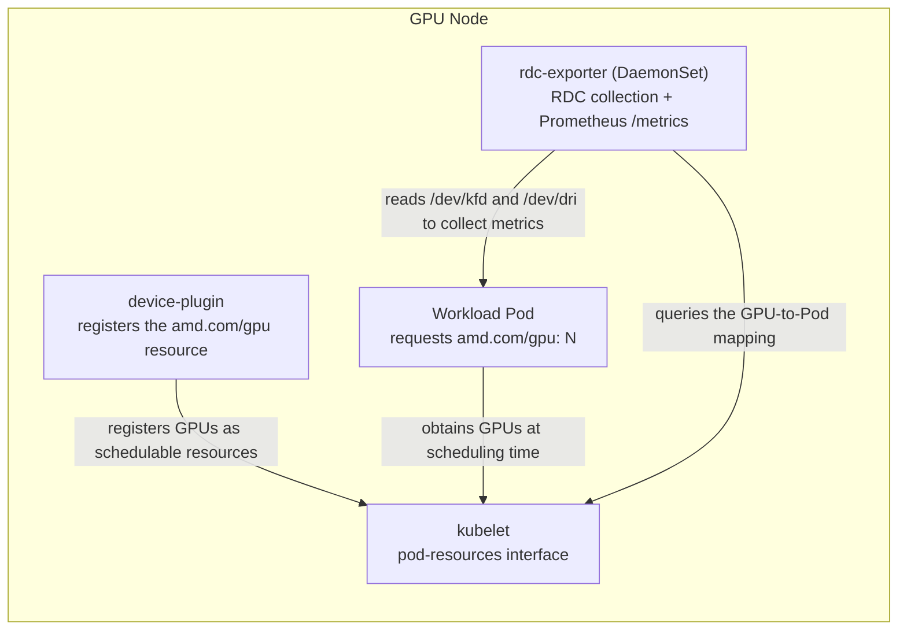

# rdc-exporter Deployment Guide

[繁體中文](README_zhtw.md) | [简体中文](README_zhcn.md)

## 1. Purpose

This guide explains how to deploy `rdc-exporter` on an existing Kubernetes cluster to collect AMD GPU monitoring metrics and associate those metrics with the workloads (Pods) that actually use the GPUs. It covers:

1. Deploying the prerequisite components: the AMD GPU device-plugin and node-labeller.
2. Deploying, configuring, and verifying `rdc-exporter`.
3. Using a vLLM inference service as an example to verify that metrics are correctly associated with Pods.

`rdc-exporter` is a Prometheus exporter written in Go. It integrates the ROCm Data Center Tool (RDC) to collect GPU metrics and uses the kubelet pod-resources interface to associate those metrics with the corresponding Pod, Namespace, and Container.

## 2. Prerequisites

Before you begin, make sure all of the following conditions are met:

| Item | Requirement |
| --- | --- |
| Kubernetes cluster | A working Kubernetes cluster is already available, and the administrative client `kubectl` can access it. Installing and configuring the cluster itself is out of scope for this guide. |
| Node architecture | GPU nodes are `amd64` (`kubernetes.io/arch=amd64`). |
| GPU and driver | Nodes have AMD GPUs with the `amdgpu` kernel driver installed; the `/dev/kfd` and `/dev/dri/*` device nodes exist. |
| Permissions | You have permission to create resources in namespaces such as `kube-system` and `monitoring`, and to adjust node taints as needed. |

## 3. Architecture Overview

The following three components each play a distinct role and together form the complete monitoring data flow:



- **node-labeller**: Labels nodes based on the AMD GPU attributes present on each node (`beta.amd.com/gpu.*`), so that label selectors can be used for scheduling. This component only manages labels; it does not register GPUs as requestable resources.
- **device-plugin**: Registers GPUs as the schedulable resource `amd.com/gpu`, so that workloads can request GPUs via `resources.limits`.
- **rdc-exporter**: Queries the "GPU-to-Pod mapping" through the kubelet pod-resources interface. Therefore, a workload must formally request GPUs through the device-plugin before `rdc-exporter` can annotate metrics with the corresponding `pod`, `namespace`, and `container`; otherwise, the metrics will carry only `gpu_index`.

## 4. Step 1: Deploy the device-plugin and node-labeller

These two components come from the official AMD project [ROCm/k8s-device-plugin](https://github.com/ROCm/k8s-device-plugin); using the official manifests for deployment is recommended.

### 4.1 Deploy the node-labeller

The node-labeller runs as a DaemonSet on every GPU node, reading GPU attributes and labeling the node. The official manifest already includes the corresponding RBAC (ClusterRole, ClusterRoleBinding) and ServiceAccount.

```bash
kubectl apply -f https://raw.githubusercontent.com/ROCm/k8s-device-plugin/master/k8s-ds-amdgpu-labeller.yaml
```

Verify:

```bash
kubectl get pod -n kube-system -l name=amdgpu-lr-ds -o wide
kubectl get nodes -L beta.amd.com/gpu.product-name
```

The Pod should be `Running`, and the nodes should be labeled with `amd.com/gpu.*` and `beta.amd.com/gpu.*` labels.

### 4.2 Deploy the device-plugin

The device-plugin runs as a DaemonSet on every GPU node, registering GPUs as the schedulable resource `amd.com/gpu`.

```bash
kubectl apply -f https://raw.githubusercontent.com/ROCm/k8s-device-plugin/master/k8s-ds-amdgpu-dp.yaml
```

Verify (the key point is that the node's `allocatable` must show the GPU count):

```bash
kubectl get pod -n kube-system -l name=amdgpu-dp-ds -o wide
kubectl get nodes -o jsonpath='{.items[0].status.allocatable.amd\.com/gpu}'
```

The last command should output the GPU count (for example, `8`), indicating that GPUs can now be requested.

> **Note:** The official manifest only tolerates the `CriticalAddonsOnly` taint. If your cluster is single-node or you schedule on the control-plane node, first remove the control-plane taint, or add the corresponding toleration to the DaemonSet yourself:
>
> ```bash
> kubectl taint nodes --all node-role.kubernetes.io/control-plane-
> ```

## 5. Step 2: Deploy rdc-exporter

### 5.1 Manifest

`rdc-exporter` container images are published to GitHub Container Registry (GHCR). Pick a release from the table below and use it as the container `image` in the manifest (the example uses the latest):

| Image tag | ROCm version | Release date |
| --- | --- | --- |
| `ghcr.io/maple52046/rdc-exporter:v1-rocm7.2.4-20260610` | 7.2.4 | 2026-06-10 (latest) |
| `ghcr.io/maple52046/rdc-exporter:v1-rocm7.2.2-20260609` | 7.2.2 | 2026-06-09 |

The tag format is `v1-rocm<ROCm-version>-<YYYYMMDD>`.

`rdc-exporter` is deployed as a DaemonSet on every GPU node and uses a ConfigMap to provide the list of metrics to collect. Save the following content as `rdc-exporter.yaml`.

> Before applying, confirm two settings: the metrics list in Section 5.2, and the pod-resources socket path in Section 5.3.

```yaml
apiVersion: v1
kind: ConfigMap
metadata:
  name: rdc-exporter-metrics
  namespace: monitoring
  labels:
    app: rdc-exporter
data:
  metrics.txt: |
    # Telemetry metrics (sourced from amd-smi / sysfs, low collection cost)
    RDC_FI_GPU_CLOCK
    RDC_FI_MEM_CLOCK
    RDC_FI_MEMORY_TEMP
    RDC_FI_GPU_TEMP
    RDC_FI_POWER_USAGE
    RDC_FI_GPU_UTIL
    RDC_FI_GPU_MEMORY_USAGE
    RDC_FI_GPU_MEMORY_TOTAL
    RDC_FI_ECC_CORRECT_TOTAL
    RDC_FI_ECC_UNCORRECT_TOTAL
    # Profiling metrics (map to GPU hardware performance counters; the count is bounded by a hardware limit, see 5.4)
    RDC_FI_PROF_OCCUPANCY_PERCENT
    RDC_FI_PROF_GPU_UTIL_PERCENT
    RDC_FI_PROF_TENSOR_ACTIVE_PERCENT
    RDC_FI_PROF_ACTIVE_CYCLES
    RDC_FI_PROF_ELAPSED_CYCLES
    RDC_FI_PROF_EVAL_FLOPS_16
---
apiVersion: apps/v1
kind: DaemonSet
metadata:
  name: rdc-exporter
  namespace: monitoring
  labels:
    app: rdc-exporter
spec:
  selector:
    matchLabels:
      app: rdc-exporter
  template:
    metadata:
      labels:
        app: rdc-exporter
    spec:
      hostNetwork: true
      containers:
        - name: rdc-exporter
          image: ghcr.io/maple52046/rdc-exporter:v1-rocm7.2.4-20260610
          imagePullPolicy: IfNotPresent
          # -k specifies the kubelet pod-resources socket; -f specifies the metrics list provided by the ConfigMap
          args:
            - "-k"
            - "/var/lib/kubelet/pod-resources/kubelet.sock"
            - "-f"
            - "/etc/rdc-exporter/metrics.txt"
          ports:
            - containerPort: 5000
              protocol: TCP
          securityContext:
            privileged: true
            capabilities:
              add: ["SYS_PTRACE"]
          volumeMounts:
            - name: dev-kfd
              mountPath: /dev/kfd
            - name: dev-dri
              mountPath: /dev/dri
            - name: pod-resources-socket
              mountPath: /var/lib/kubelet/pod-resources/kubelet.sock
              readOnly: true
            - name: metrics
              mountPath: /etc/rdc-exporter
              readOnly: true
      volumes:
        - name: dev-kfd
          hostPath:
            path: /dev/kfd
            type: CharDevice
        - name: dev-dri
          hostPath:
            path: /dev/dri
            type: Directory
        - name: pod-resources-socket
          hostPath:
            # This is the path to the kubelet pod-resources socket on the node; it must match the actual kubelet root-dir (see 5.3)
            path: /var/lib/kubelet/pod-resources/kubelet.sock
            type: Socket
        - name: metrics
          configMap:
            name: rdc-exporter-metrics
      restartPolicy: Always
      tolerations:
        - operator: Exists
  updateStrategy:
    type: RollingUpdate
    rollingUpdate:
      maxUnavailable: 100%
```

Key settings in the manifest:

- `privileged: true`, `SYS_PTRACE`, and mounting `/dev/kfd` and `/dev/dri`: required for RDC to collect GPU metrics.
- `hostNetwork: true`: the `/metrics` endpoint is exposed directly on the node's port 5000, so Prometheus can scrape it via "node IP:5000".
- `tolerations: [{operator: Exists}]`: ensures the DaemonSet can be scheduled on all GPU nodes (including control-plane nodes).

### 5.2 Configure the metrics to collect (metrics.txt)

The metrics to collect are defined in the `metrics.txt` of the ConfigMap `rdc-exporter-metrics`, which the container reads via `-f /etc/rdc-exporter/metrics.txt`. The format is one RDC metric field per line; empty lines and comment lines starting with `#` are ignored.

Metrics fall into two categories:

- **Telemetry metrics** (e.g., `RDC_FI_GPU_CLOCK`, temperature, power, utilization, memory, ECC, etc.): sourced from amd-smi / sysfs, with low collection cost and no hardware limit on the count.
- **Profiling metrics** (`RDC_FI_PROF_*`): map to GPU hardware performance counters (PMC); the number that can be collected simultaneously is bounded by a hardware limit. See Section 5.4.

After adjusting the collected metrics, update the ConfigMap and restart the DaemonSet to apply the changes:

```bash
kubectl -n monitoring edit configmap rdc-exporter-metrics
kubectl -n monitoring rollout restart daemonset/rdc-exporter
```

### 5.3 Configure the pod-resources socket path

`rdc-exporter` obtains the "GPU-to-Pod mapping" through the kubelet pod-resources socket. The manifest mounts that socket into the container via a hostPath, and its path must match the actual kubelet root-dir on the node. This path varies by Kubernetes distribution:

| Kubernetes distribution | pod-resources socket path on the node |
| --- | --- |
| Standard kubelet (e.g., kubeadm) | `/var/lib/kubelet/pod-resources/kubelet.sock` |
| k0s | `/var/lib/k0s/kubelet/pod-resources/kubelet.sock` |

You can confirm the actual kubelet root-dir on the node with the following command (no output means the default value `/var/lib/kubelet` is used):

```bash
ps -ewwo args | grep -o 'root-dir=[^ ]*'
```

If the actual path differs from the default, adjust only the hostPath `path` in the `volumes` section of the manifest; the in-container mount path and the `-k` argument can remain unchanged.

```yaml
        - name: pod-resources-socket
          hostPath:
            path: /var/lib/kubelet/pod-resources/kubelet.sock   # adjust to the node's actual kubelet root-dir
            type: Socket
```

### 5.4 Caveat: the hardware limit on profiling metrics

Profiling metrics (`RDC_FI_PROF_*`) map to GPU hardware performance counters (PMC), and these counters are packed into a single PMC packet. If too many profiling metrics are requested simultaneously, the GPU's PMC packet capacity is exceeded, causing the underlying profiling component to fail while building the packet, with an error similar to the following:

```
Could not create PMC packets! AQLProfile Return Code: 4096
```

This error occurs in a background worker thread, so the main process does not exit. As a result, the Pod stays `Running` with 0 restarts, but `/metrics` stops updating and keeps returning only the last successfully collected data. This situation is difficult to detect with a typical liveness probe.

Recommended practice:

- Telemetry metrics can be added freely according to your monitoring needs.
- Start with a small number of profiling metrics and add them gradually, verifying as you go, according to your GPU model.
- The default metrics list in this guide (10 telemetry + 6 profiling) is a verified, conservative combination. Verification on the AMD Instinct MI355X (gfx950) shows that collecting 6 profiling metrics simultaneously works reliably, whereas collecting around 18 triggers the error above.

> **Note:** This is a limitation of the hardware counter packet capacity, not a permissions issue; adjusting container privileges or the host's `kernel.perf_event_paranoid` parameter will not resolve this error.

### 5.5 Deploy and verify

```bash
kubectl create namespace monitoring
kubectl apply -f rdc-exporter.yaml
```

Verify the DaemonSet and the metrics endpoint:

```bash
kubectl get pod -n monitoring -l app=rdc-exporter -o wide
curl -s localhost:5000/metrics | head -20
```

Expect one `Running` Pod on each GPU node, with `/metrics` returning GPU metric data.

## 6. Step 3: Verify with a vLLM inference service

This section uses a vLLM inference service as an example to verify the complete data flow: after a workload requests GPUs through the device-plugin, `rdc-exporter` can correctly associate metrics with that Pod.

> **Key point:** The workload must request GPUs via `resources.limits.amd.com/gpu: N`. Only then will the kubelet record the GPUs in the pod-resources interface, allowing `rdc-exporter` to look up the mapping. If you only mount `/dev/dri` directly without requesting GPUs through the device-plugin, the container may be able to access the GPUs, but `rdc-exporter` will not be able to associate metrics with that Pod.

### 6.1 Manifest

Save the following content as `vllm-qwen.yaml`. This example runs with `--tensor-parallel-size 2` (TP=2), which requires 2 GPUs, so `amd.com/gpu` is set to `2`; the two must match.

```yaml
apiVersion: apps/v1
kind: Deployment
metadata:
  name: vllm-qwen
  namespace: default
  labels:
    app: vllm-qwen
spec:
  replicas: 1
  selector:
    matchLabels:
      app: vllm-qwen
  template:
    metadata:
      labels:
        app: vllm-qwen
    spec:
      containers:
        - name: vllm
          image: rocm/ali-private:ubuntu22.04_rocm7.2.3_vllm_ec8d60be_aiter_0.1.13.post1_20260605
          imagePullPolicy: IfNotPresent
          # The image's entrypoint is /bin/bash, so it must be overridden to run vllm serve
          command: ["vllm"]
          args:
            - "serve"
            - "Qwen/Qwen2.5-0.5B-Instruct"
            - "--tensor-parallel-size"
            - "2"
            - "--host"
            - "0.0.0.0"
            - "--port"
            - "8000"
          ports:
            - containerPort: 8000
              name: http
          resources:
            limits:
              amd.com/gpu: 2          # request 2 GPUs through the device-plugin (the critical setting)
          readinessProbe:
            httpGet:
              path: /health
              port: 8000
            initialDelaySeconds: 30
            periodSeconds: 10
            failureThreshold: 60
          volumeMounts:
            - name: dshm
              mountPath: /dev/shm     # vLLM / RCCL needs a larger shared memory segment
      volumes:
        - name: dshm
          emptyDir:
            medium: Memory
            sizeLimit: 8Gi
---
apiVersion: v1
kind: Service
metadata:
  name: vllm-qwen
  namespace: default
  labels:
    app: vllm-qwen
spec:
  selector:
    app: vllm-qwen
  ports:
    - name: http
      port: 8000
      targetPort: 8000
```

### 6.2 Deploy and wait until ready

```bash
kubectl apply -f vllm-qwen.yaml
kubectl get pod -l app=vllm-qwen -o wide
```

The first deployment needs to pull the image and load the model, so it takes a while to become ready. Wait until the Pod is `Running` and `READY` is `1/1`.

### 6.3 Confirm the container obtained GPUs and the service works

```bash
POD=$(kubectl get pod -l app=vllm-qwen -o jsonpath='{.items[0].metadata.name}')
kubectl exec "$POD" -- bash -lc 'ls /dev/dri | grep -c renderD'
IP=$(kubectl get pod -l app=vllm-qwen -o jsonpath='{.items[0].status.podIP}')
curl -s "$IP:8000/v1/models"
```

Expect 2 `renderD*` devices to be visible inside the container, and `/v1/models` to return the loaded `Qwen/Qwen2.5-0.5B-Instruct` model.

### 6.4 Confirm rdc-exporter has associated Pod information

```bash
curl -s localhost:5000/metrics | grep 'pod="vllm-qwen'
```

Expect the allocated GPUs (e.g., `gpu_index="0"`, `"1"`) to be annotated with `container`, `namespace`, and `pod`:

```text
gpu_memory_usage{container="vllm",gpu_index="0",namespace="default",pod="vllm-qwen-..."} 287252.5
gpu_memory_usage{container="vllm",gpu_index="1",namespace="default",pod="vllm-qwen-..."} 287252.5
```

After applying inference load to the service, metrics such as `gpu_clock`, `power_usage`, `active_cycles`, and the profiling metrics should rise accordingly, indicating that both metric collection and Pod association are working correctly.

### 6.5 Remove the example

```bash
kubectl delete -f vllm-qwen.yaml
```

## 7. Troubleshooting

| Symptom | Possible cause and resolution |
| --- | --- |
| Pod cannot be scheduled with `amd.com/gpu` (`Insufficient amd.com/gpu`) | The device-plugin is not deployed, or the node's `allocatable.amd.com/gpu` is 0. Confirm that Section 4.2 is complete; deploying only the node-labeller is not sufficient. |
| Pods for the device-plugin, node-labeller, or rdc-exporter stay `Pending` | The node has an untolerated taint (common on single-node or control-plane nodes). Remove the taint or add the corresponding toleration to the DaemonSet. |
| `/metrics` metrics have only `gpu_index` and are missing the `pod`, `namespace`, and `container` labels | The workload did not request GPUs through the device-plugin; or the hostPath path of the pod-resources socket is incorrect (see Section 5.3). |
| The rdc-exporter Pod is `Running`, but `/metrics` data is no longer updating | The number of profiling metrics exceeds the GPU PMC packet limit (see Section 5.4). Reduce the number of `RDC_FI_PROF_*` metrics and run `rollout restart`. |
| No `amd.com/gpu.*` labels appear on the node | Confirm that the node has an AMD GPU and driver (`/dev/kfd` exists), and that the node-labeller is privileged and has `/sys` and `/dev` mounted. |

## 8. References

- AMD GPU device-plugin and node-labeller: [ROCm/k8s-device-plugin](https://github.com/ROCm/k8s-device-plugin)
- ROCm Data Center Tool (RDC): [ROCm/rdc](https://github.com/ROCm/rdc)
- vLLM: [vllm-project/vllm](https://github.com/vllm-project/vllm)
