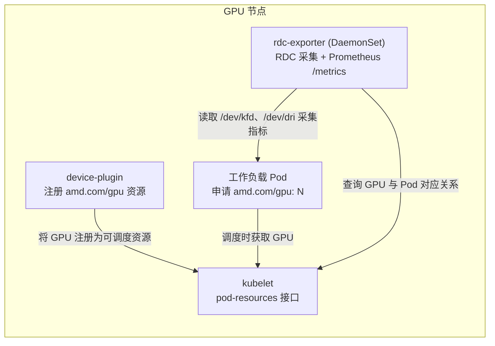

# rdc-exporter 部署指南

[English](README.md) | [繁體中文](README_zhtw.md)

## 1. 文档目的

本指南说明如何在既有的 Kubernetes 集群上部署 `rdc-exporter`，以采集 AMD GPU 监控指标，并将指标关联至实际使用 GPU 的工作负载（Pod）。内容涵盖：

1. 前置组件部署：AMD GPU device-plugin 与 node-labeller。
2. `rdc-exporter` 的部署、配置与验证。
3. 以 vLLM 推理服务作为示例，验证指标与 Pod 的关联是否正确。

`rdc-exporter` 是一套以 Go 开发的 Prometheus Exporter，集成 ROCm Data Center Tool（RDC）采集 GPU 指标，并通过 kubelet 的 pod-resources 接口，将指标关联至对应的 Pod、Namespace 与 Container。

## 2. 前置需求

在开始之前，请确认下列条件均已满足：

| 项目 | 需求 |
| --- | --- |
| Kubernetes 集群 | 已具备一套可正常运行的 Kubernetes 集群，且管理客户端 `kubectl` 可访问该集群。集群本身的安装与配置不在本指南范围内。 |
| kubelet pod-resources API | 每个 GPU worker 节点都必须启用 kubelet 的 **pod-resources API**，即节点上必须存在 socket `/var/lib/kubelet/pod-resources/kubelet.sock`。`rdc-exporter` 正是通过此接口获取 GPU 与 Pod 的对应关系。实际 socket 路径可能因 Kubernetes 发行版而异（确认方式请参阅第 5.3 节）。 |
| 节点架构 | GPU 节点为 `amd64`（`kubernetes.io/arch=amd64`）。 |
| GPU 与驱动 | 节点具备 AMD GPU，且已安装 `amdgpu` 内核驱动；`/dev/kfd` 与 `/dev/dri/*` 设备节点存在。 |
| 权限 | 具备于 `kube-system`、`monitoring` 等命名空间创建资源，以及按需调整节点 taint 的权限。 |

## 3. 架构概览

下列三个组件各司其职，共同构成完整的监控数据流：



- **node-labeller**：依节点上的 AMD GPU 属性为节点加上标签（`beta.amd.com/gpu.*`），供标签选择器（label selector）进行调度。此组件仅负责标签，不会将 GPU 注册为可申请的资源。
- **device-plugin**：将 GPU 注册为可调度资源 `amd.com/gpu`，工作负载才能通过 `resources.limits` 申请 GPU。
- **rdc-exporter**：通过 kubelet 的 pod-resources 接口查询“GPU 与 Pod 的对应关系”。因此，工作负载必须经由 device-plugin 正式申请 GPU，`rdc-exporter` 才能将指标标注上对应的 `pod`、`namespace` 与 `container`；否则指标仅会带有 `gpu_index`。

## 4. 步骤一：部署 device-plugin 与 node-labeller

此二组件来自 AMD 官方项目 [ROCm/k8s-device-plugin](https://github.com/ROCm/k8s-device-plugin)，建议使用官方清单部署。

### 4.1 部署 node-labeller

node-labeller 以 DaemonSet 形式运行于每个 GPU 节点，读取 GPU 属性并为节点加上标签。官方清单已包含对应的 RBAC（ClusterRole、ClusterRoleBinding）与 ServiceAccount。

```bash
kubectl apply -f https://raw.githubusercontent.com/ROCm/k8s-device-plugin/master/k8s-ds-amdgpu-labeller.yaml
```

验证：

```bash
kubectl get pod -n kube-system -l name=amdgpu-lr-ds -o wide
kubectl get nodes -L beta.amd.com/gpu.product-name
```

预期 Pod 状态为 `Running`，且节点被加上 `amd.com/gpu.*` 与 `beta.amd.com/gpu.*` 等标签。

### 4.2 部署 device-plugin

device-plugin 以 DaemonSet 形式运行于每个 GPU 节点，将 GPU 注册为可调度资源 `amd.com/gpu`。

```bash
kubectl apply -f https://raw.githubusercontent.com/ROCm/k8s-device-plugin/master/k8s-ds-amdgpu-dp.yaml
```

验证（关键在于节点的 `allocatable` 须显示 GPU 数量）：

```bash
kubectl get pod -n kube-system -l name=amdgpu-dp-ds -o wide
kubectl get nodes -o jsonpath='{.items[0].status.allocatable.amd\.com/gpu}'
```

最后一条命令应输出 GPU 数量（例如 `8`），代表 GPU 已可被申请。

> **注意：** 官方清单仅容忍（tolerate）`CriticalAddonsOnly` taint。若集群为单节点或在 control-plane 节点上调度，请先移除 control-plane taint，或为 DaemonSet 自行加上对应的 toleration：
>
> ```bash
> kubectl taint nodes --all node-role.kubernetes.io/control-plane-
> ```

## 5. 步骤二：部署 rdc-exporter

### 5.1 配置清单

`rdc-exporter` 容器镜像发布于 GitHub Container Registry（GHCR）。请从下表挑选一个版本作为配置清单中的容器 `image`（示例使用最新版）：

| 镜像标签（image tag） | ROCm 版本 | 发布日期 |
| --- | --- | --- |
| `ghcr.io/maple52046/rdc-exporter:v1-rocm7.2.4-20260610` | 7.2.4 | 2026-06-10（最新） |
| `ghcr.io/maple52046/rdc-exporter:v1-rocm7.2.2-20260609` | 7.2.2 | 2026-06-09 |

标签格式为 `v1-rocm<ROCm 版本>-<YYYYMMDD>`。

`rdc-exporter` 以 DaemonSet 形式部署于每个 GPU 节点，并使用 ConfigMap 提供要采集的指标清单。请将下列内容保存为 `rdc-exporter.yaml`。

> 应用前请先确认两项配置：第 5.2 节的监控指标清单，以及第 5.3 节的 pod-resources socket 路径。

```yaml
apiVersion: v1
kind: ConfigMap
metadata:
  name: rdc-exporter-metrics
  namespace: monitoring
  labels:
    app: rdc-exporter
data:
  metrics.txt: |
    # Telemetry 指标（来源为 amd-smi / sysfs，采集成本低）
    RDC_FI_GPU_CLOCK
    RDC_FI_MEM_CLOCK
    RDC_FI_MEMORY_TEMP
    RDC_FI_GPU_TEMP
    RDC_FI_POWER_USAGE
    RDC_FI_GPU_UTIL
    RDC_FI_GPU_MEMORY_USAGE
    RDC_FI_GPU_MEMORY_TOTAL
    RDC_FI_ECC_CORRECT_TOTAL
    RDC_FI_ECC_UNCORRECT_TOTAL
    # Profiling 指标（对应 GPU 硬件性能计数器，数量受硬件上限限制，详见 5.4）
    RDC_FI_PROF_OCCUPANCY_PERCENT
    RDC_FI_PROF_GPU_UTIL_PERCENT
    RDC_FI_PROF_TENSOR_ACTIVE_PERCENT
    RDC_FI_PROF_ACTIVE_CYCLES
    RDC_FI_PROF_ELAPSED_CYCLES
    RDC_FI_PROF_EVAL_FLOPS_16
---
apiVersion: apps/v1
kind: DaemonSet
metadata:
  name: rdc-exporter
  namespace: monitoring
  labels:
    app: rdc-exporter
spec:
  selector:
    matchLabels:
      app: rdc-exporter
  template:
    metadata:
      labels:
        app: rdc-exporter
    spec:
      hostNetwork: true
      containers:
        - name: rdc-exporter
          image: ghcr.io/maple52046/rdc-exporter:v1-rocm7.2.4-20260610
          imagePullPolicy: IfNotPresent
          # -k 指定 kubelet pod-resources socket；-f 指定 ConfigMap 提供的指标清单
          args:
            - "-k"
            - "/var/lib/kubelet/pod-resources/kubelet.sock"
            - "-f"
            - "/etc/rdc-exporter/metrics.txt"
          ports:
            - containerPort: 5000
              protocol: TCP
          securityContext:
            privileged: true
            capabilities:
              add: ["SYS_PTRACE"]
          volumeMounts:
            - name: dev-kfd
              mountPath: /dev/kfd
            - name: dev-dri
              mountPath: /dev/dri
            - name: pod-resources-socket
              mountPath: /var/lib/kubelet/pod-resources/kubelet.sock
              readOnly: true
            - name: metrics
              mountPath: /etc/rdc-exporter
              readOnly: true
      volumes:
        - name: dev-kfd
          hostPath:
            path: /dev/kfd
            type: CharDevice
        - name: dev-dri
          hostPath:
            path: /dev/dri
            type: Directory
        - name: pod-resources-socket
          hostPath:
            # 此为节点上 kubelet 的 pod-resources socket 路径，须与实际 kubelet root-dir 一致（详见 5.3）
            path: /var/lib/kubelet/pod-resources/kubelet.sock
            type: Socket
        - name: metrics
          configMap:
            name: rdc-exporter-metrics
      restartPolicy: Always
      tolerations:
        - operator: Exists
  updateStrategy:
    type: RollingUpdate
    rollingUpdate:
      maxUnavailable: 100%
```

配置清单的关键配置说明：

- `privileged: true` 与 `SYS_PTRACE`、挂载 `/dev/kfd` 与 `/dev/dri`：RDC 采集 GPU 指标所需。
- `hostNetwork: true`：`/metrics` 端点直接暴露于节点的 5000 端口，Prometheus 可通过“节点 IP:5000”抓取。
- `tolerations: [{operator: Exists}]`：确保 DaemonSet 可于所有 GPU 节点（含 control-plane 节点）调度。

### 5.2 配置要采集的指标（metrics.txt）

要采集的指标定义于 ConfigMap `rdc-exporter-metrics` 的 `metrics.txt`，容器以 `-f /etc/rdc-exporter/metrics.txt` 读取。格式为每行一个 RDC 指标字段；空行与以 `#` 开头的注释行会被忽略。

指标分为两类：

- **Telemetry 指标**（例如 `RDC_FI_GPU_CLOCK`、温度、功耗、使用率、内存、ECC 等）：来源为 amd-smi / sysfs，采集成本低，数量不受硬件限制。
- **Profiling 指标**（`RDC_FI_PROF_*`）：对应 GPU 硬件性能计数器（PMC），可同时采集的数量受硬件上限限制，请参阅第 5.4 节。

调整采集指标后，更新 ConfigMap 并重启 DaemonSet 使其生效：

```bash
kubectl -n monitoring edit configmap rdc-exporter-metrics
kubectl -n monitoring rollout restart daemonset/rdc-exporter
```

### 5.3 配置 pod-resources socket 路径

`rdc-exporter` 通过 kubelet 的 pod-resources socket 获取“GPU 与 Pod 的对应关系”。配置清单以 hostPath 将该 socket 挂载至容器，其路径必须与节点上实际的 kubelet root-dir 一致。此路径因 Kubernetes 发行版而异：

| Kubernetes 发行版 | 节点上的 pod-resources socket 路径 |
| --- | --- |
| 标准 kubelet（如 kubeadm） | `/var/lib/kubelet/pod-resources/kubelet.sock` |
| k0s | `/var/lib/k0s/kubelet/pod-resources/kubelet.sock` |

可于节点上以下列命令确认实际的 kubelet root-dir（无输出代表使用默认值 `/var/lib/kubelet`）：

```bash
ps -ewwo args | grep -o 'root-dir=[^ ]*'
```

若实际路径与默认值不同，请仅调整配置清单中 `volumes` 区段的 hostPath `path`；容器内挂载路径与 `-k` 参数可维持不变。

```yaml
        - name: pod-resources-socket
          hostPath:
            path: /var/lib/kubelet/pod-resources/kubelet.sock   # 根据节点实际 kubelet root-dir 调整
            type: Socket
```

### 5.4 注意事项：Profiling 指标的硬件上限

Profiling 指标（`RDC_FI_PROF_*`）对应 GPU 硬件性能计数器（PMC），这些计数器会被打包进单一 PMC 数据包。若同时请求过多 profiling 指标，将超出 GPU 的 PMC 数据包容量，导致底层 profiling 组件于构建数据包时失败，并出现类似下列的错误：

```
Could not create PMC packets! AQLProfile Return Code: 4096
```

此错误发生于后台工作线程，主进程不会退出。其结果是：Pod 仍维持 `Running` 状态且重启次数为 0，但 `/metrics` 会停止更新，仅持续返回最后一次成功采集的数据。此情况不易由一般存活探针（liveness probe）检测。

建议做法：

- Telemetry 指标可按监控需求自由加入。
- Profiling 指标请从少量开始，并按你的 GPU 型号逐步增加并验证。
- 本指南默认的指标清单（10 个 telemetry + 6 个 profiling）为经过验证的保守组合。于 AMD Instinct MI355X（gfx950）上的验证显示，同时采集 6 个 profiling 指标可稳定运行，而采集约 18 个则会触发上述错误。

> **说明：** 此为硬件计数器数据包容量的限制，并非权限问题；调整容器权限或主机 `kernel.perf_event_paranoid` 参数均无法解决此错误。

### 5.5 部署与验证

```bash
kubectl create namespace monitoring
kubectl apply -f rdc-exporter.yaml
```

验证 DaemonSet 与指标端点：

```bash
kubectl get pod -n monitoring -l app=rdc-exporter -o wide
curl -s localhost:5000/metrics | head -20
```

预期每个 GPU 节点各有一个 `Running` 状态的 Pod，且 `/metrics` 返回 GPU 指标数据。

## 6. 步骤三：以 vLLM 推理服务验证

本节以一个 vLLM 推理服务作为示例，验证完整数据流：工作负载通过 device-plugin 申请 GPU 后，`rdc-exporter` 能正确将指标关联至该 Pod。

> **重点：** 工作负载必须通过 `resources.limits.amd.com/gpu: N` 申请 GPU。唯有如此，kubelet 才会将 GPU 记录于 pod-resources 接口，`rdc-exporter` 才能查得对应关系。若仅直接挂载 `/dev/dri` 而未经 device-plugin 申请，容器虽可能访问 GPU，但 `rdc-exporter` 将无法把指标关联至该 Pod。

### 6.1 配置清单

请将下列内容保存为 `vllm-qwen.yaml`（相同清单亦可在代码库的 `example/vllm-qwen.yml` 获取）。此示例以 `--tensor-parallel-size 1`（TP=1）运行一个小型的 `Qwen/Qwen2.5-0.5B-Instruct` 模型，需要 1 块 GPU，故 `amd.com/gpu` 设为 `1`，两者须一致。

```yaml
apiVersion: apps/v1
kind: Deployment
metadata:
  name: vllm-qwen
  namespace: default
  labels:
    app: vllm-qwen
spec:
  replicas: 1
  selector:
    matchLabels:
      app: vllm-qwen
  template:
    metadata:
      labels:
        app: vllm-qwen
    spec:
      tolerations:
        - operator: Exists
      containers:
        - name: vllm
          image: rocm/vllm:v0.14.0_amd_dev
          imagePullPolicy: IfNotPresent
          workingDir: /app
          command: ["vllm"]
          args:
            - "serve"
            - "Qwen/Qwen2.5-0.5B-Instruct"
            - "--tensor-parallel-size"
            - "1"
            - "--gpu-memory-utilization"
            - "0.06"
            - "--max-model-len"
            - "4096"
            - "--max-num-seqs"
            - "32"
            - "--enforce-eager"
            - "--host"
            - "0.0.0.0"
            - "--port"
            - "8000"
          ports:
            - containerPort: 8000
              name: http
          env:
            - name: HF_HOME
              value: /tmp/hf
          resources:
            limits:
              amd.com/gpu: 1          # 通过 device-plugin 申请 1 块 GPU（关键配置）
          readinessProbe:
            httpGet:
              path: /health
              port: 8000
            initialDelaySeconds: 20
            periodSeconds: 5
            failureThreshold: 60
          volumeMounts:
            - name: dshm
              mountPath: /dev/shm     # vLLM 需要较大的共享内存
      volumes:
        - name: dshm
          emptyDir:
            medium: Memory
            sizeLimit: 8Gi
---
apiVersion: v1
kind: Service
metadata:
  name: vllm-qwen
  namespace: default
  labels:
    app: vllm-qwen
spec:
  selector:
    app: vllm-qwen
  ports:
    - name: http
      port: 8000
      targetPort: 8000
```

### 6.2 部署与等待就绪

```bash
kubectl apply -f vllm-qwen.yaml
kubectl get pod -l app=vllm-qwen -o wide
```

首次部署需拉取镜像并加载模型，就绪时间较长，请等待 Pod 状态变为 `Running` 且 `READY` 为 `1/1`。

### 6.3 确认容器获取 GPU 且服务正常

```bash
POD=$(kubectl get pod -l app=vllm-qwen -o jsonpath='{.items[0].metadata.name}')
kubectl exec "$POD" -- bash -lc 'ls /dev/dri | grep -c renderD'
IP=$(kubectl get pod -l app=vllm-qwen -o jsonpath='{.items[0].status.podIP}')
curl -s "$IP:8000/v1/models"
```

预期容器内可见 1 个 `renderD*` 设备，且 `/v1/models` 返回所加载的 `Qwen/Qwen2.5-0.5B-Instruct` 模型。

### 6.4 确认 rdc-exporter 已关联 Pod 信息

```bash
curl -s localhost:5000/metrics | grep 'pod="vllm-qwen'
```

预期被分配的 GPU（例如 `gpu_index="0"`）会被标注上 `container`、`namespace` 与 `pod`：

```text
gpu_memory_usage{container="vllm",gpu_index="0",namespace="default",pod="vllm-qwen-..."} 287252.5
```

对服务施加推理负载后，`gpu_clock`、`power_usage`、`active_cycles` 及 profiling 等指标应随之上升，代表指标采集与 Pod 关联均正常运行。

### 6.5 移除示例

```bash
kubectl delete -f vllm-qwen.yaml
```

## 7. 故障排查

| 症状 | 可能原因与处理方式 |
| --- | --- |
| Pod 无法以 `amd.com/gpu` 调度（`Insufficient amd.com/gpu`） | 尚未部署 device-plugin，或节点 `allocatable.amd.com/gpu` 为 0。请确认第 4.2 节已完成；仅部署 node-labeller 并不足够。 |
| device-plugin、node-labeller 或 rdc-exporter 的 Pod 持续 `Pending` | 节点存在未被容忍的 taint（单节点或 control-plane 节点常见）。请移除该 taint 或为 DaemonSet 加上对应 toleration。 |
| `/metrics` 指标仅有 `gpu_index`，缺少 `pod`、`namespace`、`container` 标签 | 工作负载未通过 device-plugin 申请 GPU；或 pod-resources socket 的 hostPath 路径不正确（参阅第 5.3 节）。 |
| rdc-exporter Pod 为 `Running`，但 `/metrics` 数据不再更新 | profiling 指标数量超出 GPU PMC 数据包上限（参阅第 5.4 节）。请减少 `RDC_FI_PROF_*` 指标数量后执行 `rollout restart`。 |
| 节点未出现任何 `amd.com/gpu.*` 标签 | 确认节点具备 AMD GPU 与驱动（`/dev/kfd` 存在），且 node-labeller 为 privileged 并已挂载 `/sys` 与 `/dev`。 |

## 8. 参考资料

- AMD GPU device-plugin 与 node-labeller：[ROCm/k8s-device-plugin](https://github.com/ROCm/k8s-device-plugin)
- ROCm Data Center Tool（RDC）：[ROCm/rdc](https://github.com/ROCm/rdc)
- vLLM：[vllm-project/vllm](https://github.com/vllm-project/vllm)
