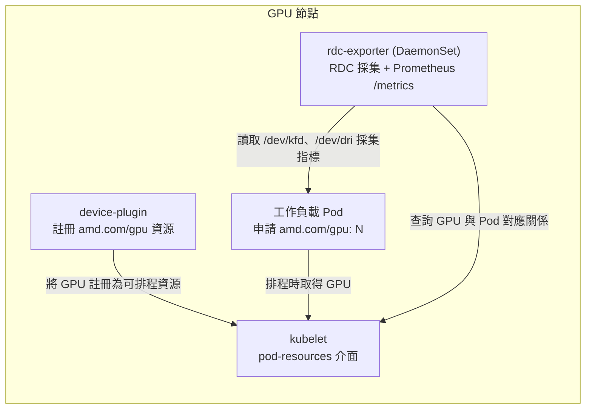

# rdc-exporter 部署指南

[English](README.md) | [简体中文](README_zhcn.md)

## 1. 文件目的

本指南說明如何在既有的 Kubernetes 叢集上部署 `rdc-exporter`，以採集 AMD GPU 監控指標，並將指標關聯至實際使用 GPU 的工作負載（Pod）。內容涵蓋：

1. 前置元件部署：AMD GPU device-plugin 與 node-labeller。
2. `rdc-exporter` 的部署、設定與驗證。
3. 以 vLLM 推論服務作為範例，驗證指標與 Pod 的關聯是否正確。

`rdc-exporter` 是一套以 Go 開發的 Prometheus Exporter，整合 ROCm Data Center Tool（RDC）採集 GPU 指標，並透過 kubelet 的 pod-resources 介面，將指標關聯至對應的 Pod、Namespace 與 Container。

## 2. 前置需求

在開始之前，請確認下列條件均已滿足：

| 項目 | 需求 |
| --- | --- |
| Kubernetes 叢集 | 已具備一套可正常運作的 Kubernetes 叢集，且管理用戶端 `kubectl` 可存取該叢集。叢集本身的安裝與設定不在本指南範圍內。 |
| kubelet pod-resources API | 每個 GPU worker 節點都必須啟用 kubelet 的 **pod-resources API**，亦即節點上必須存在 socket `/var/lib/kubelet/pod-resources/kubelet.sock`。`rdc-exporter` 正是透過此介面取得 GPU 與 Pod 的對應關係。實際 socket 路徑可能因 Kubernetes 發行版而異（確認方式請參閱第 5.3 節）。 |
| 節點架構 | GPU 節點為 `amd64`（`kubernetes.io/arch=amd64`）。 |
| GPU 與驅動 | 節點具備 AMD GPU，且已安裝 `amdgpu` 核心驅動；`/dev/kfd` 與 `/dev/dri/*` 裝置節點存在。 |
| 權限 | 具備於 `kube-system`、`monitoring` 等命名空間建立資源，以及視需要調整節點 taint 的權限。 |

## 3. 架構概觀

下列三個元件各司其職，共同構成完整的監控資料流：



- **node-labeller**：依節點上的 AMD GPU 屬性為節點加上標籤（`beta.amd.com/gpu.*`），供標籤選擇器（label selector）進行排程。此元件僅負責標籤，不會將 GPU 註冊為可申請的資源。
- **device-plugin**：將 GPU 註冊為可排程資源 `amd.com/gpu`，工作負載才能透過 `resources.limits` 申請 GPU。
- **rdc-exporter**：透過 kubelet 的 pod-resources 介面查詢「GPU 與 Pod 的對應關係」。因此，工作負載必須經由 device-plugin 正式申請 GPU，`rdc-exporter` 才能將指標標註上對應的 `pod`、`namespace` 與 `container`；否則指標僅會帶有 `gpu_index`。

## 4. 步驟一：部署 device-plugin 與 node-labeller

此二元件來自 AMD 官方專案 [ROCm/k8s-device-plugin](https://github.com/ROCm/k8s-device-plugin)，建議使用官方資訊清單部署。

### 4.1 部署 node-labeller

node-labeller 以 DaemonSet 形式執行於每個 GPU 節點，讀取 GPU 屬性並為節點加上標籤。官方資訊清單已包含對應的 RBAC（ClusterRole、ClusterRoleBinding）與 ServiceAccount。

```bash
kubectl apply -f https://raw.githubusercontent.com/ROCm/k8s-device-plugin/master/k8s-ds-amdgpu-labeller.yaml
```

驗證：

```bash
kubectl get pod -n kube-system -l name=amdgpu-lr-ds -o wide
kubectl get nodes -L beta.amd.com/gpu.product-name
```

預期 Pod 狀態為 `Running`，且節點被加上 `amd.com/gpu.*` 與 `beta.amd.com/gpu.*` 等標籤。

### 4.2 部署 device-plugin

device-plugin 以 DaemonSet 形式執行於每個 GPU 節點，將 GPU 註冊為可排程資源 `amd.com/gpu`。

```bash
kubectl apply -f https://raw.githubusercontent.com/ROCm/k8s-device-plugin/master/k8s-ds-amdgpu-dp.yaml
```

驗證（關鍵在於節點的 `allocatable` 須顯示 GPU 數量）：

```bash
kubectl get pod -n kube-system -l name=amdgpu-dp-ds -o wide
kubectl get nodes -o jsonpath='{.items[0].status.allocatable.amd\.com/gpu}'
```

最後一道指令應輸出 GPU 數量（例如 `8`），代表 GPU 已可被申請。

> **注意：** 官方資訊清單僅容忍（tolerate）`CriticalAddonsOnly` taint。若叢集為單節點或在 control-plane 節點上排程，請先移除 control-plane taint，或為 DaemonSet 自行加上對應的 toleration：
>
> ```bash
> kubectl taint nodes --all node-role.kubernetes.io/control-plane-
> ```

## 5. 步驟二：部署 rdc-exporter

### 5.1 資訊清單

`rdc-exporter` 容器映像發佈於 GitHub Container Registry（GHCR）。請從下表挑選一個版本作為資訊清單中的容器 `image`（範例使用最新版）：

| 映像標籤（image tag） | ROCm 版本 | 發佈日期 |
| --- | --- | --- |
| `ghcr.io/maple52046/rdc-exporter:v1-rocm7.2.4-20260610` | 7.2.4 | 2026-06-10（最新） |
| `ghcr.io/maple52046/rdc-exporter:v1-rocm7.2.2-20260609` | 7.2.2 | 2026-06-09 |

標籤格式為 `v1-rocm<ROCm 版本>-<YYYYMMDD>`。

`rdc-exporter` 以 DaemonSet 形式部署於每個 GPU 節點，並使用 ConfigMap 提供要採集的指標清單。請將下列內容存為 `rdc-exporter.yaml`。

> 套用前請先確認兩項設定：第 5.2 節的監控指標清單，以及第 5.3 節的 pod-resources socket 路徑。

```yaml
apiVersion: v1
kind: ConfigMap
metadata:
  name: rdc-exporter-metrics
  namespace: monitoring
  labels:
    app: rdc-exporter
data:
  metrics.txt: |
    # Telemetry 指標（來源為 amd-smi / sysfs，採集成本低）
    RDC_FI_GPU_CLOCK
    RDC_FI_MEM_CLOCK
    RDC_FI_MEMORY_TEMP
    RDC_FI_GPU_TEMP
    RDC_FI_POWER_USAGE
    RDC_FI_GPU_UTIL
    RDC_FI_GPU_MEMORY_USAGE
    RDC_FI_GPU_MEMORY_TOTAL
    RDC_FI_ECC_CORRECT_TOTAL
    RDC_FI_ECC_UNCORRECT_TOTAL
    # Profiling 指標（對應 GPU 硬體效能計數器，數量受硬體上限限制，詳見 5.4）
    RDC_FI_PROF_OCCUPANCY_PERCENT
    RDC_FI_PROF_GPU_UTIL_PERCENT
    RDC_FI_PROF_TENSOR_ACTIVE_PERCENT
    RDC_FI_PROF_ACTIVE_CYCLES
    RDC_FI_PROF_ELAPSED_CYCLES
    RDC_FI_PROF_EVAL_FLOPS_16
---
apiVersion: apps/v1
kind: DaemonSet
metadata:
  name: rdc-exporter
  namespace: monitoring
  labels:
    app: rdc-exporter
spec:
  selector:
    matchLabels:
      app: rdc-exporter
  template:
    metadata:
      labels:
        app: rdc-exporter
    spec:
      hostNetwork: true
      containers:
        - name: rdc-exporter
          image: ghcr.io/maple52046/rdc-exporter:v1-rocm7.2.4-20260610
          imagePullPolicy: IfNotPresent
          # -k 指定 kubelet pod-resources socket；-f 指定 ConfigMap 提供的指標清單
          args:
            - "-k"
            - "/var/lib/kubelet/pod-resources/kubelet.sock"
            - "-f"
            - "/etc/rdc-exporter/metrics.txt"
          ports:
            - containerPort: 5000
              protocol: TCP
          securityContext:
            privileged: true
            capabilities:
              add: ["SYS_PTRACE"]
          volumeMounts:
            - name: dev-kfd
              mountPath: /dev/kfd
            - name: dev-dri
              mountPath: /dev/dri
            - name: pod-resources-socket
              mountPath: /var/lib/kubelet/pod-resources/kubelet.sock
              readOnly: true
            - name: metrics
              mountPath: /etc/rdc-exporter
              readOnly: true
      volumes:
        - name: dev-kfd
          hostPath:
            path: /dev/kfd
            type: CharDevice
        - name: dev-dri
          hostPath:
            path: /dev/dri
            type: Directory
        - name: pod-resources-socket
          hostPath:
            # 此為節點上 kubelet 的 pod-resources socket 路徑，須與實際 kubelet root-dir 相符（詳見 5.3）
            path: /var/lib/kubelet/pod-resources/kubelet.sock
            type: Socket
        - name: metrics
          configMap:
            name: rdc-exporter-metrics
      restartPolicy: Always
      tolerations:
        - operator: Exists
  updateStrategy:
    type: RollingUpdate
    rollingUpdate:
      maxUnavailable: 100%
```

資訊清單的關鍵設定說明：

- `privileged: true` 與 `SYS_PTRACE`、掛載 `/dev/kfd` 與 `/dev/dri`：RDC 採集 GPU 指標所需。
- `hostNetwork: true`：`/metrics` 端點直接開放於節點的 5000 連接埠，Prometheus 可透過「節點 IP:5000」抓取。
- `tolerations: [{operator: Exists}]`：確保 DaemonSet 可於所有 GPU 節點（含 control-plane 節點）排程。

### 5.2 設定要採集的指標（metrics.txt）

要採集的指標定義於 ConfigMap `rdc-exporter-metrics` 的 `metrics.txt`，容器以 `-f /etc/rdc-exporter/metrics.txt` 讀取。格式為每行一個 RDC 指標欄位；空行與以 `#` 開頭的註解行會被忽略。

指標分為兩類：

- **Telemetry 指標**（例如 `RDC_FI_GPU_CLOCK`、溫度、功耗、使用率、記憶體、ECC 等）：來源為 amd-smi / sysfs，採集成本低，數量不受硬體限制。
- **Profiling 指標**（`RDC_FI_PROF_*`）：對應 GPU 硬體效能計數器（PMC），可同時採集的數量受硬體上限限制，請參閱第 5.4 節。

調整採集指標後，更新 ConfigMap 並重啟 DaemonSet 使其生效：

```bash
kubectl -n monitoring edit configmap rdc-exporter-metrics
kubectl -n monitoring rollout restart daemonset/rdc-exporter
```

### 5.3 設定 pod-resources socket 路徑

`rdc-exporter` 透過 kubelet 的 pod-resources socket 取得「GPU 與 Pod 的對應關係」。資訊清單以 hostPath 將該 socket 掛載至容器，其路徑必須與節點上實際的 kubelet root-dir 相符。此路徑因 Kubernetes 發行版而異：

| Kubernetes 發行版 | 節點上的 pod-resources socket 路徑 |
| --- | --- |
| 標準 kubelet（如 kubeadm） | `/var/lib/kubelet/pod-resources/kubelet.sock` |
| k0s | `/var/lib/k0s/kubelet/pod-resources/kubelet.sock` |

可於節點上以下列指令確認實際的 kubelet root-dir（無輸出代表使用預設值 `/var/lib/kubelet`）：

```bash
ps -ewwo args | grep -o 'root-dir=[^ ]*'
```

若實際路徑與預設值不同，請僅調整資訊清單中 `volumes` 區段的 hostPath `path`；容器內掛載路徑與 `-k` 參數可維持不變。

```yaml
        - name: pod-resources-socket
          hostPath:
            path: /var/lib/kubelet/pod-resources/kubelet.sock   # 依節點實際 kubelet root-dir 調整
            type: Socket
```

### 5.4 注意事項：Profiling 指標的硬體上限

Profiling 指標（`RDC_FI_PROF_*`）對應 GPU 硬體效能計數器（PMC），這些計數器會被打包進單一 PMC 封包。若同時要求過多 profiling 指標，將超出 GPU 的 PMC 封包容量，導致底層 profiling 元件於建立封包時失敗，並出現類似下列的錯誤：

```
Could not create PMC packets! AQLProfile Return Code: 4096
```

此錯誤發生於背景工作執行緒，主程序不會結束。其結果是：Pod 仍維持 `Running` 狀態且重啟次數為 0，但 `/metrics` 會停止更新，僅持續回傳最後一次成功採集的數據。此情況不易由一般存活性檢查（liveness probe）偵測。

建議做法：

- Telemetry 指標可依監控需求自由加入。
- Profiling 指標請從少量開始，並依您的 GPU 型號逐步增加並驗證。
- 本指南預設的指標清單（10 個 telemetry + 6 個 profiling）為經過驗證的保守組合。於 AMD Instinct MI355X（gfx950）上的驗證顯示，同時採集 6 個 profiling 指標可穩定運作，而採集約 18 個則會觸發上述錯誤。

> **說明：** 此為硬體計數器封包容量的限制，並非權限問題；調整容器權限或主機 `kernel.perf_event_paranoid` 參數均無法解決此錯誤。

### 5.5 部署與驗證

```bash
kubectl create namespace monitoring
kubectl apply -f rdc-exporter.yaml
```

驗證 DaemonSet 與指標端點：

```bash
kubectl get pod -n monitoring -l app=rdc-exporter -o wide
curl -s localhost:5000/metrics | head -20
```

預期每個 GPU 節點各有一個 `Running` 狀態的 Pod，且 `/metrics` 回傳 GPU 指標資料。

## 6. 步驟三：以 vLLM 推論服務驗證

本節以一個 vLLM 推論服務作為範例，驗證完整資料流：工作負載透過 device-plugin 申請 GPU 後，`rdc-exporter` 能正確將指標關聯至該 Pod。

> **重點：** 工作負載必須透過 `resources.limits.amd.com/gpu: N` 申請 GPU。唯有如此，kubelet 才會將 GPU 記錄於 pod-resources 介面，`rdc-exporter` 才能查得對應關係。若僅直接掛載 `/dev/dri` 而未經 device-plugin 申請，容器雖可能存取 GPU，但 `rdc-exporter` 將無法把指標關聯至該 Pod。

### 6.1 資訊清單

請將下列內容存為 `vllm-qwen.yaml`（相同清單亦可在原始碼庫的 `example/vllm-qwen.yml` 取得）。此範例以 `--tensor-parallel-size 1`（TP=1）執行一個小型的 `Qwen/Qwen2.5-0.5B-Instruct` 模型，需要 1 顆 GPU，故 `amd.com/gpu` 設為 `1`，兩者須一致。

```yaml
apiVersion: apps/v1
kind: Deployment
metadata:
  name: vllm-qwen
  namespace: default
  labels:
    app: vllm-qwen
spec:
  replicas: 1
  selector:
    matchLabels:
      app: vllm-qwen
  template:
    metadata:
      labels:
        app: vllm-qwen
    spec:
      tolerations:
        - operator: Exists
      containers:
        - name: vllm
          image: rocm/vllm:v0.14.0_amd_dev
          imagePullPolicy: IfNotPresent
          workingDir: /app
          command: ["vllm"]
          args:
            - "serve"
            - "Qwen/Qwen2.5-0.5B-Instruct"
            - "--tensor-parallel-size"
            - "1"
            - "--gpu-memory-utilization"
            - "0.06"
            - "--max-model-len"
            - "4096"
            - "--max-num-seqs"
            - "32"
            - "--enforce-eager"
            - "--host"
            - "0.0.0.0"
            - "--port"
            - "8000"
          ports:
            - containerPort: 8000
              name: http
          env:
            - name: HF_HOME
              value: /tmp/hf
          resources:
            limits:
              amd.com/gpu: 1          # 透過 device-plugin 申請 1 顆 GPU（關鍵設定）
          readinessProbe:
            httpGet:
              path: /health
              port: 8000
            initialDelaySeconds: 20
            periodSeconds: 5
            failureThreshold: 60
          volumeMounts:
            - name: dshm
              mountPath: /dev/shm     # vLLM 需要較大的共享記憶體
      volumes:
        - name: dshm
          emptyDir:
            medium: Memory
            sizeLimit: 8Gi
---
apiVersion: v1
kind: Service
metadata:
  name: vllm-qwen
  namespace: default
  labels:
    app: vllm-qwen
spec:
  selector:
    app: vllm-qwen
  ports:
    - name: http
      port: 8000
      targetPort: 8000
```

### 6.2 部署與等待就緒

```bash
kubectl apply -f vllm-qwen.yaml
kubectl get pod -l app=vllm-qwen -o wide
```

首次部署需拉取映像檔並載入模型，就緒時間較長，請等待 Pod 狀態變為 `Running` 且 `READY` 為 `1/1`。

### 6.3 確認容器取得 GPU 且服務正常

```bash
POD=$(kubectl get pod -l app=vllm-qwen -o jsonpath='{.items[0].metadata.name}')
kubectl exec "$POD" -- bash -lc 'ls /dev/dri | grep -c renderD'
IP=$(kubectl get pod -l app=vllm-qwen -o jsonpath='{.items[0].status.podIP}')
curl -s "$IP:8000/v1/models"
```

預期容器內可見 1 個 `renderD*` 裝置，且 `/v1/models` 回傳所載入的 `Qwen/Qwen2.5-0.5B-Instruct` 模型。

### 6.4 確認 rdc-exporter 已關聯 Pod 資訊

```bash
curl -s localhost:5000/metrics | grep 'pod="vllm-qwen'
```

預期被分配的 GPU（例如 `gpu_index="0"`）會被標註上 `container`、`namespace` 與 `pod`：

```text
gpu_memory_usage{container="vllm",gpu_index="0",namespace="default",pod="vllm-qwen-..."} 287252.5
```

對服務施加推論負載後，`gpu_clock`、`power_usage`、`active_cycles` 及 profiling 等指標應隨之上升，代表指標採集與 Pod 關聯均正常運作。

### 6.5 移除範例

```bash
kubectl delete -f vllm-qwen.yaml
```

## 7. 疑難排解

| 症狀 | 可能原因與處理方式 |
| --- | --- |
| Pod 無法以 `amd.com/gpu` 排程（`Insufficient amd.com/gpu`） | 尚未部署 device-plugin，或節點 `allocatable.amd.com/gpu` 為 0。請確認第 4.2 節已完成；僅部署 node-labeller 並不足夠。 |
| device-plugin、node-labeller 或 rdc-exporter 的 Pod 持續 `Pending` | 節點存在未被容忍的 taint（單節點或 control-plane 節點常見）。請移除該 taint 或為 DaemonSet 加上對應 toleration。 |
| `/metrics` 指標僅有 `gpu_index`，缺少 `pod`、`namespace`、`container` 標籤 | 工作負載未透過 device-plugin 申請 GPU；或 pod-resources socket 的 hostPath 路徑不正確（參閱第 5.3 節）。 |
| rdc-exporter Pod 為 `Running`，但 `/metrics` 數據不再更新 | profiling 指標數量超出 GPU PMC 封包上限（參閱第 5.4 節）。請減少 `RDC_FI_PROF_*` 指標數量後執行 `rollout restart`。 |
| 節點未出現任何 `amd.com/gpu.*` 標籤 | 確認節點具備 AMD GPU 與驅動（`/dev/kfd` 存在），且 node-labeller 為 privileged 並已掛載 `/sys` 與 `/dev`。 |

## 8. 參考資料

- AMD GPU device-plugin 與 node-labeller：[ROCm/k8s-device-plugin](https://github.com/ROCm/k8s-device-plugin)
- ROCm Data Center Tool（RDC）：[ROCm/rdc](https://github.com/ROCm/rdc)
- vLLM：[vllm-project/vllm](https://github.com/vllm-project/vllm)
