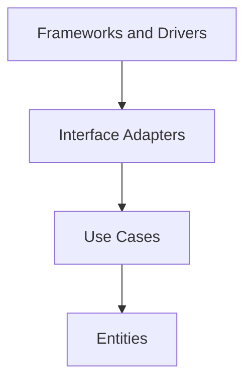

# Architecture Spec

This document is the architecture constitution for `rdc-exporter`. It defines the architecture rules that all developers and AI agents must follow when performing requirement analysis, design, implementation, refactoring, and documentation updates within this repository.

This project adopts **Clean Architecture** as its primary architectural principle, combined with the **Domain-Driven Design (DDD) principles for handling the core domain** (Distillation and Ubiquitous Language). Together they keep the core business rules independent of frameworks, external SDKs, transport protocols, and deployment details, while concentrating design attention on the core domain that truly creates value.

This document is compiled from:

- [The Clean Architecture](https://blog.cleancoder.com/uncle-bob/2012/08/13/the-clean-architecture.html)
- [Domain-Driven Design Reference: Definitions and Pattern Summaries](https://www.domainlanguage.com/wp-content/uploads/2016/05/DDD_Reference_2015-03.pdf)

This project is a single Go module (`github.com/ROCm/rdc-exporter`) with no additional components or sub projects, and it exposes no public API. Therefore this document does not cover multi-component structure, API contract workflow, or sub project spec discovery.

This document is the sole architecture constitution of this project. All design, implementation, and refactoring take the architectural principles stated here as the highest authority. Anything that conflicts with this document must first be stopped and clarified so that it returns to the principles stated here. The rules must not be selectively ignored, nor relaxed on the basis of local conventions or existing code.

## Core Goals

The design of this project must satisfy the following goals:

- Separation of concerns: business rules, application flow, adapters, and external tools must be layered and must not be mixed together.
- Independent of frameworks: frameworks and external SDKs are tools, not the center of the core architecture.
- Testable: business rules and use cases must be testable without starting the RDC library, an HTTP server, the Prometheus registry, or physical GPUs.
- Independent of delivery mechanism: the output form of metrics (Prometheus text, HTTP endpoint, CLI parser, etc.) can be replaced without affecting the core business rules.
- Independent of external agencies: the core logic must not know about the details of the RDC C library, cgo bindings, the Prometheus client, the operating system, or transport protocols.

## Dependency Rule

The most important rule in Clean Architecture is the Dependency Rule: source code dependencies may only point inward.



The direction of dependency means:

- Outer layers may know about inner layers.
- Inner layers must not import, reference, name, or depend on outer layers.
- Inner layers must not accept data types from outer frameworks, such as cgo `C.*` types, RDC binding structs, `prometheus.Metric`, or `*http.Request`.
- Changes in outer layers must not force changes to inner business rules.

If flow control requires an inner layer to invoke an outer capability, dependency inversion must be used: the inner layer defines the required port/interface, and the outer layer provides the implementation.

## Layer Responsibilities

The following defines the responsibility boundaries of each layer. Directory and package names may evolve with the project, but the responsibility boundaries and the direction of dependency between layers must remain clear.

### Entities (innermost layer)

Responsible for core business concepts and stable rules that span use cases.

May contain:

- Domain types and value objects, such as metric definitions, fields, GPU index, scale, and label rules.
- Business rules that can run without depending on external systems, such as converting a raw field value into an output value via scale, and the rules for assembling and validating labels.
- Business invariants and state transitions.

Must not contain:

- RDC binding types, cgo `C.*` types, or Prometheus client types.
- HTTP, CLI, or any transport-protocol payload.
- Framework lifecycle or deployment configuration.

### Use Cases

Describe application-specific business flows and are responsible for orchestrating entities and ports.

May contain:

- Application services, for example the flow that "collects the fields of the specified GPUs according to the catalog configuration, applies scale and labels, and produces a metric result set".
- Command/query handlers.
- Definitions of ports/interfaces such as repository, source, clock, and publisher (driven by the needs of the consuming side).

Must not contain:

- Direct calls to RDC bindings or cgo.
- Prometheus registration and output format, HTTP routing, or CLI flag parsing.

### Interface Adapters

Responsible for converting data formats between the inner and outer layers.

May contain:

- Scraper adapter: converts the field values returned by the RDC binding into inner-layer input models.
- Exporter collector / presenter: converts the use case result model into Prometheus metrics.
- Mappers and DTOs for catalog and labeler.
- Concrete implementations of the ports defined by the inner layer (their external calls are completed through frameworks/drivers).

Must avoid passing outer-layer formats (cgo structs, `prometheus.*`, CLI arguments) directly into use cases or entities.

### Frameworks and Drivers (outermost layer)

Responsible for concrete tools and the execution environment. Code here should stay thin and mainly handle wiring, configuration, and glue code.

May contain:

- cgo / external SDK bindings (for example the binding for the RDC C library).
- Prometheus client library and HTTP server bootstrap.
- Entry points (`main`) and flag/config loading.
- Logging backend, catalog config file reading, and other I/O.

## Crossing Boundaries with Data

When passing data across layers, the data format must favor the form that is easiest for the inner layer to understand and maintain.

- Before entering a use case, RDC field values, catalog YAML, and CLI arguments must first be converted into an inner-layer input model or simple values.
- When a use case returns to the outer layer, it should return an inner-layer result model or simple values, which the adapter then converts into a Prometheus metric, log, or HTTP response.
- Do not pass cgo `C.*` types, RDC binding structs, `prometheus.Metric`, or other third-party types into entities/use cases.
- Cross-boundary data should use clear, stable, low-coupling structs, primitive values, or explicit domain types.

```go
// Good: the use case receives an input model defined for the application rule.
type CollectMetricsInput struct {
	GPUIndexes []int
	FieldIDs   []FieldID
}

// Bad: the use case depends on external SDK details.
func CollectMetrics(values []C.rdc_field_value) error
```

## Interfaces and Dependency Inversion

Interfaces exist to protect inner-layer rules, not to decorate every struct.

- Interfaces should be defined by the consuming side, describing the capability the use case actually needs, for example "read the specified fields of a set of GPUs".
- Interfaces should stay small and explicit, avoiding leaking the full RDC or Prometheus API into the inner layer.
- Outer layers implement the ports defined by the inner layer, such as field source, metric publisher, and catalog provider.
- Do not create vague abstractions for the sake of "possible future replacement"; introduce them only when crossing boundaries or isolating for tests requires it.

```go
// Good: the use case owns the data source need.
type FieldSource interface {
	ReadFields(gpuIndexes []int, fieldIDs []FieldID) ([]FieldSample, error)
}
```

## Error and Resource Boundaries

- Use cases should return errors with business meaning and avoid exposing the raw error types of RDC bindings, cgo, Prometheus, or HTTP.
- Adapters may wrap external errors and convert them into error semantics that the use case can understand.
- The lifecycle of external resources (RDC handler initialization and release, GPU group / field group creation and cleanup, HTTP server start and stop) is an outer-layer responsibility; the inner layer only describes the need and does not hold concrete handles.
- Do not let an entity depend on an RDC handler, cgo resources, or request context.

## DDD: Core Domain Principles

This project combines the DDD principles for handling the core domain, which complement the layering of Clean Architecture. Clean Architecture is the primary architecture: it determines the boundaries, the direction of dependency, and where code lives. The DDD core domain principles are an overlay that determines where to focus design attention, modeling depth, and review intensity.

These two views are orthogonal and must not be confused. The subdomain classification (core / supporting / generic) describes the problem space; the layers (Entities, Use Cases, Interface Adapters, Frameworks and Drivers) describe the solution structure and the direction of dependency. When the two appear to disagree, the Dependency Rule and Clean Architecture layering always win: a DDD classification never authorizes an inner layer to depend on an outer layer, and never overrides how a layer boundary is drawn.

### Distillation

The system contains subdomains with different value and different rates of change. During development they must be identified and recorded in documentation, naming, and tests:

- **Core Domain**: the part that most creates differentiated value and most deserves deep modeling and design investment. For this project, the core domain is the set of domain rules and semantics that "collects the raw fields of GPUs, then performs scale conversion according to the configuration, attaches the correct labels, and produces metrics that monitoring systems can consume". Because these are framework-independent business rules and application flow, the Dependency Rule places them in the inner layers (Entities and Use Cases); they must stay small and clear.
- **Supporting Subdomain**: supports the core domain but is not the main source of differentiation, for example the metric configuration (catalog) model and the rules for assembling label source information.
- **Generic Subdomain**: necessary but generic problems, which should be simplified, bought, or isolated, for example external SDK / cgo bindings, the Prometheus client, the HTTP server, CLI flag parsing, config file reading, and logging. In this project these are concrete tools and infrastructure, so the Dependency Rule keeps them in the outer layers (Interface Adapters and Frameworks and Drivers).

Subdomain classification guides how much modeling effort, isolation, and review intensity a part deserves; it does not by itself assign a layer. Layer placement is always governed by the Dependency Rule. A supporting or generic subdomain may still hold framework-independent rules in an inner layer, and belonging to the core domain never justifies depending on an outer layer.

Rules:

- Any change that affects the core domain (metric collection and conversion rules, the semantics of field/GPU/label) must raise the review intensity and synchronously update this document, the related naming, and the tests.
- The generic subdomain must not absorb the design attention of the core domain. When generic mechanisms (cgo details, Prometheus types) begin to obscure the domain semantics, they must be separated into the outer layer so that the inner-layer model stays clear.
- The core domain must be verifiable without external systems, following the layered testing rules below: entity rules with pure unit tests, and use-case flows with fake or in-memory ports. If it is hard to test, it usually means an outer-layer concern has leaked inward and the boundary needs correcting.

### Ubiquitous Language

- Within the domain, this project must use a consistent language and keep documentation, tests, output metric names, and code naming aligned.
- A change in language is a change in the model: if code naming is inconsistent with the established domain semantics, first decide whether naming needs adjustment or whether synonyms and forbidden terms need to be explicitly recorded, and only then proceed with implementation.
- Do not improvise new domain terms, types, or field semantics before the domain semantics are confirmed.
- Naming must also follow [`coding-style.md`](coding-style.md): avoid names without clear domain meaning such as `util`, `common`, `helper`, and `model`, and let package names reflect their domain responsibility.

## Testing Requirements

- Entities must be verifiable with pure unit tests, without mocking external systems.
- Use cases must be testable with fake or in-memory port implementations, without starting the RDC library, physical GPUs, an HTTP server, or the Prometheus registry.
- Interface adapters should test data conversion, error mapping, and framework integration.
- Frameworks and drivers tests should focus on wiring and integration and should not re-test inner-layer business rules.
- If a piece of core logic is hard to test, it usually means the direction of dependency or the responsibility boundaries need adjustment, rather than skipping the test.

## Prohibitions

The following practices violate the architectural principles of this project:

- An entity or use case importing an external SDK / cgo binding, the `prometheus` client, a web framework, or any other outer-layer package.
- A use case directly calling RDC bindings, operating cgo resources, or producing Prometheus metrics.
- An inner-layer function accepting a cgo `C.*` type, an RDC binding struct, `prometheus.Metric`, `*http.Request`, or any other external payload.
- Putting tags bound to an external framework into an entity, unless the tag is part of a stable inner-layer data contract and is documented.
- Putting cross-layer data structures into vague packages such as `common`, `util`, or `model` for the sake of sharing convenience.
- Letting the error codes, status codes, or data formats of an external framework become part of the business rules.
- Letting the details of a generic subdomain (cgo, Prometheus, HTTP) leak into the model and flow of the core domain.
- Skipping tests because testing is difficult, instead of correcting the architectural boundary.

## Pre-Development Checklist

Before starting any development work, developers and agents must complete:

- Have read this document.
- Have determined whether the target code belongs to an entity, use case, interface adapter, or framework/driver.
- Have identified whether this work touches the core domain, a supporting subdomain, or a generic subdomain.
- Have confirmed that naming is consistent with the domain semantics and complies with [`coding-style.md`](coding-style.md).
- Have confirmed whether this document, the tests, or related descriptions need synchronous updates.

## Agent Execution Rules

When an AI agent adds or modifies code in this project, it must follow these rules:

- Before modifying, first determine the layer and subdomain (core / supporting / generic) the target code belongs to.
- When adding imports, check the direction of dependency; inner layers must not import outer layers.
- When adding cross-layer data passing, confirm that the data format is defined by the inner layer or is inner-layer friendly, and do not pass cgo/Prometheus/HTTP types into the inner layer.
- When adding integration with external tools, frameworks, SDKs, or transports, place it only in the outer layer and connect it to the inner layer through a port/interface.
- When modifying a use case or entity, keep it testable without starting the RDC library, physical GPUs, or external systems.
- If a new interface is needed, first confirm that it is driven by the needs of the consuming side rather than created to wrap a concrete implementation.
- Do not create new domain terms, types, fields, or metric semantics before the domain semantics are confirmed; naming must conform to the established ubiquitous language.
- If a change affects the core domain, raise the review intensity and synchronously update this document and the tests.
- When modifying architectural boundaries, data boundaries, or the direction of dependency, update the documentation and tests synchronously.
- Must follow the Go comment, naming, error handling, and testing rules in [`coding-style.md`](coding-style.md).
